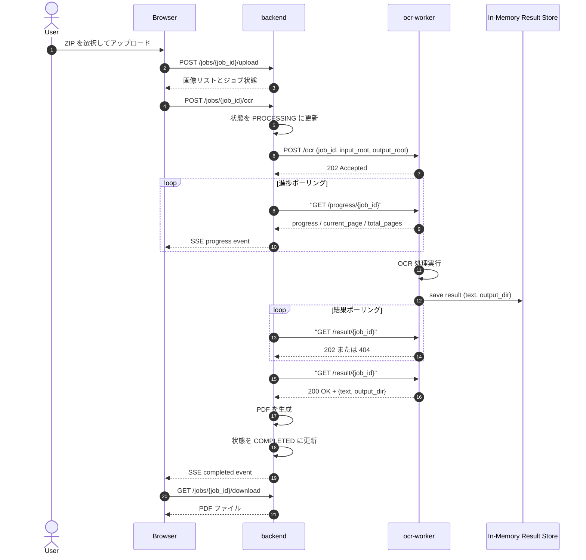
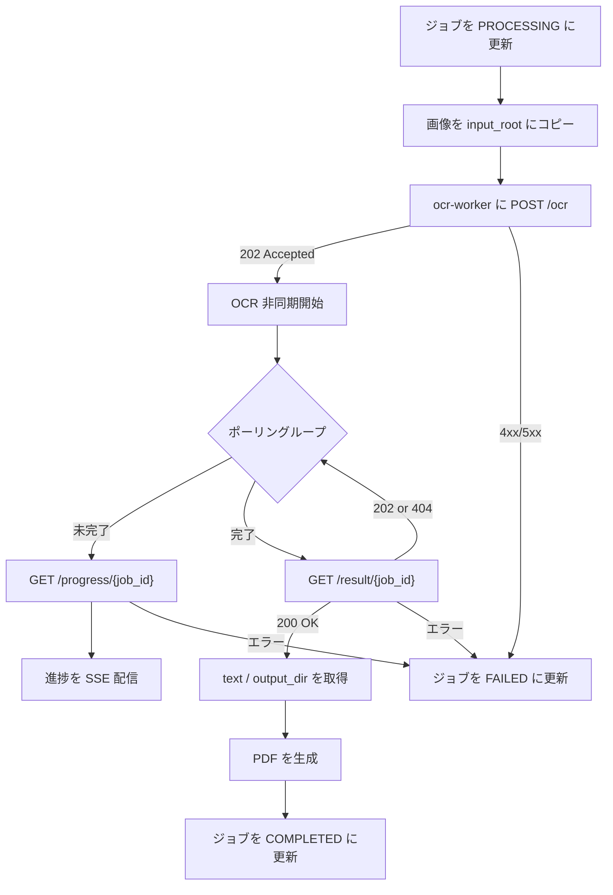
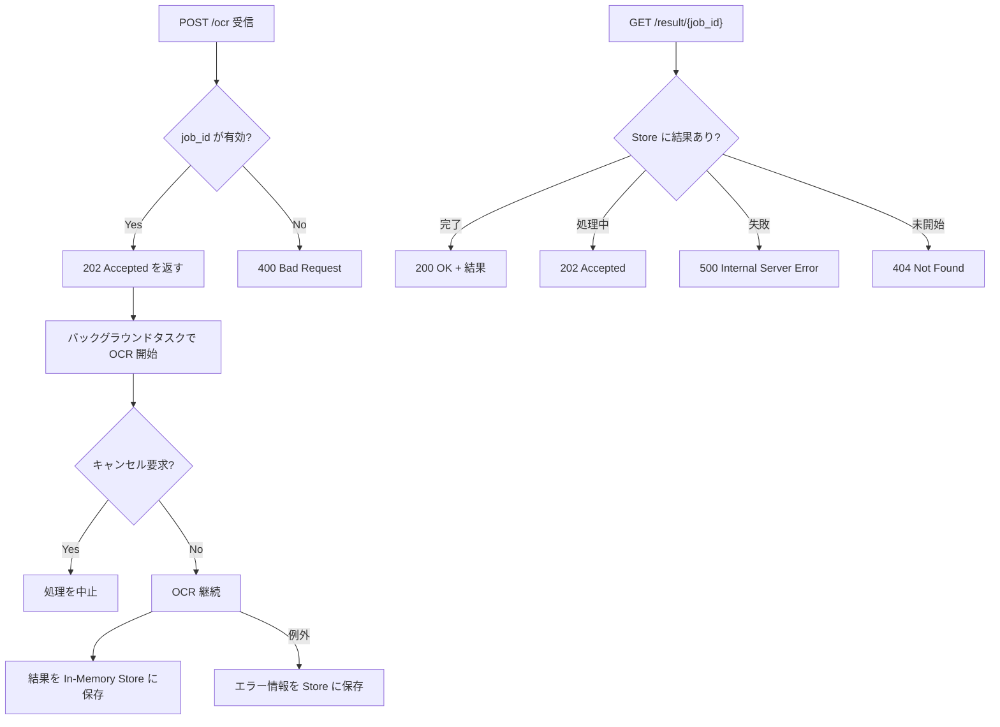

# backend→ocr-worker 非同期 OCR 通信設計

> 最終更新: 2026/09/16

---

## 1. 背景と目的

現在の `backend` は `ocr-worker` の `POST /ocr` を同期呼び出ししており、OCR 処理が完了するまで HTTP 接続を維持しています。
大容量・多ページのジョブでは数分〜数十分の待ち時間が発生するため、以下の問題があります。

- 長時間の HTTP 接続がタイムアウトしやすい
- `ocr-worker` コンテナの一時的な再起動やネットワークの揺らぎでジョブ全体が失敗しやすい
- backend のワーカースレッド（またはイベントループ）が処理中に占有される

本設計では、`POST /ocr` を **fire-and-forget** な非同期リクエストに変更し、
処理結果は新設の `GET /result/{job_id}` で取得する方式に移行します。

---

## 2. 設計の概要

### 2.1 非同期化の基本方針

| 項目 | 現行 | 変更後 |
|---|---|---|
| OCR 開始 | `POST /ocr` 同期 | `POST /ocr` 非同期（202 Accepted） |
| 結果取得 | 同期レスポンス内 | `GET /result/{job_id}` |
| タイムアウト | `OCR_WORKER_REQUEST_TIMEOUT`（長時間接続） | 接続保持をやめ、短期の個別リクエストに分解 |
| 進捗確認 | `GET /progress/{job_id}` | そのまま継続利用 |

### 2.2 新規エンドポイント

`ocr-worker` に以下を追加します。

- `POST /ocr` ... 非同期で OCR を開始。即座に `202 Accepted` を返す
- `GET /result/{job_id}` ... OCR 完了後の `{text, output_dir}` を返す
  - 処理中: `202 Accepted`（または `404 Not Found`）
  - 完了: `200 OK` + 結果 JSON
  - 失敗: `500 Internal Server Error` + エラーメッセージ

### 2.3 backend 側の変更

- `RemoteNdloCrOcrEngine.run()` を `async def run_async()` に変更
  - `POST /ocr` を即座に送信して 202 を受信
  - その後 `GET /result/{job_id}` をポーリングして結果を取得
- `backend/app/routers/jobs.py` の `_run_ocr_and_generate_pdf()` を非同期ポーリング方式に変更
- `docker-compose.yml` から `OCR_WORKER_REQUEST_TIMEOUT` を削除

---

## 3. シーケンス図



---

## 4. 処理フロー図

### 4.1 backend: `_run_ocr_and_generate_pdf` 非同期フロー



### 4.2 ocr-worker: 非同期 OCR 実行フロー



---

## 5. API 仕様

### 5.1 ocr-worker: POST /ocr

- **説明**: OCR 非同期実行を開始します。即座に 202 を返します。
- **リクエストボディ**: 既存の `OcrRequest` と同一
  - `input_root`, `output_root`, `config_file`, `proc_range`, `save_image`, `save_xml`, `dump`, `input_structure`, `ruby_only`, `job_id`, `enable_progress`
- **成功レスポンス**: `202 Accepted`
  ```json
  {
    "message": "OCR 処理を開始しました",
    "job_id": "string"
  }
  ```
- **失敗レスポンス**: `400 Bad Request` / `500 Internal Server Error`

### 5.2 ocr-worker: GET /result/{job_id}

- **説明**: OCR 完了後の結果を取得します。
- **パスパラメータ**: `job_id`
- **レスポンス**:

| 状態 | HTTP ステータス | ボディ |
|---|---|---|
| 未完了 | 202 Accepted | `{"message": "OCR 処理中です", "job_id": "..."}` |
| 完了 | 200 OK | `{"text": "...", "output_dir": "..."}` |
| 失敗 | 500 Internal Server Error | `{"detail": "OCR 処理に失敗しました: ..."}` |
| 未知 | 404 Not Found | `{"detail": "指定されたジョブが見つかりません"}` |

---

## 6. 結果ストア設計

### 6.1 データ構造

`ocr-worker` 内にモジュールレベルの辞書で管理します。

```python
# module: ocr_worker/app/result_store.py（新規）
_results: dict[str, dict] = {}
```

保存内容:

```python
{
    "status": "processing" | "completed" | "failed",
    "text": str | None,
    "output_dir": str | None,
    "message": str | None,
}
```

### 6.2 ライフサイクル

1. `POST /ocr` 受信時に `_results[job_id]` を `status=processing` で初期化
2. OCR 完了後に `status=completed`、失敗時に `status=failed` を設定
3. 結果取得後、backend は PDF 生成に利用
4. ジョブ完了後、backend のクリーンアップ処理で不要になった結果を削除
   - `DELETE /result/{job_id}` を新設して backend から明示的に削除可能にする（オプション）

### 6.3 メモリリーク対策

- 結果はジョブ完了後に backend から削除リクエストを送信
- 安全策として TTL（例: 24 時間）を設け、古いエントリを自動削除

---

## 7. エラーハンドリング

### 7.1 backend 側

| シナリオ | 動作 |
|---|---|
| `POST /ocr` で ocr-worker 接続不可 | ジョブを FAILED に設定し、SSE でエラーを通知 |
| `POST /ocr` で 4xx/5xx | 同上 |
| 結果ポーリングで継続的な 202 | 通常通り進捗ポーリングを継続 |
| 結果取得で 500 | ジョブを FAILED に設定、メッセージを SSE で通知 |
| 結果取得で 404（永続的） | 一定回数リトライ後 FAILED |

### 7.2 ocr-worker 側

| シナリオ | 動作 |
|---|---|
| 処理中に例外 | `_results[job_id] = {"status": "failed", "message": str(exc)}` |
| キャンセル要求 | 処理を停止し、結果を failed に設定 |
| 結果取得時に存在しない job_id | 404 Not Found |

---

## 8. 影響範囲

### 8.1 変更対象ファイル

| ファイル | 変更内容 |
|---|---|
| `ocr-worker/app/main.py` | `POST /ocr` を非同期化、`GET /result/{job_id}` 追加 |
| `ocr-worker/app/result_store.py` | 新規: 結果一時保持モジュール |
| `backend/app/services/ocr_engine.py` | `RemoteNdloCrOcrEngine` を非同期ポーリング方式に変更 |
| `backend/app/routers/jobs.py` | `_run_ocr_and_generate_pdf()` の非同期化 |
| `docker-compose.yml` | `OCR_WORKER_REQUEST_TIMEOUT` 削除 |
| `backend/tests/test_ocr_engine.py` | 非同期呼び出しのテスト追加・更新 |
| `ocr-worker/tests/test_main.py` | 非同期 `POST /ocr` と `GET /result/{job_id}` のテスト追加 |

### 8.2 下位互換性

- API 契約が変わるため、frontend/backend/ocr-worker は同時に更新する必要があります
- 以前の同期 `POST /ocr` は廃止します

---

## 9. 考慮事項

- **結果ストアの永続化**: 現状はメモリ内で十分ですが、将来的に複数 ocr-worker レプリカを配置する場合は Redis 等の共有ストアが必要です
- **ジョブ完了後のクリーンアップ**: 結果ストアのメモリ解放を確実に行うため、backend 側でジョブ完了時に結果削除を呼び出します
- **タイムアウト値**: 個別 HTTP リクエストは短時間（例: 10 秒）で十分です。長時間の接続保持は行いません
- **ポーリング間隔**: `OCR_WORKER_POLL_INTERVAL` をそのまま利用し、進捗取得と結果取得を同じ間隔で実施します
- **エッジケース**: ocr-worker 再起動時はメモリ内の結果が失われるため、backend は最終的に FAILED と判定できるようにします

---

## 10. 決定事項

| ID | 項目 | 決定内容 |
|---|---|---|
| BE009-D001 | OCR 開始方式 | fire-and-forget: `POST /ocr` は 202 を返す |
| BE009-D002 | 結果取得方式 | 新設 `GET /result/{job_id}` をポーリング |
| BE009-D003 | 結果ストア | ocr-worker 内メモリ辞書、TTL 付きで自動削除 |
| BE009-D004 | エラー状態 | 結果ストアに "failed" 状態を持たせ、`GET /result/{job_id}` で 500 を返す |
| BE009-D005 | タイムアウト設定 | `docker-compose.yml` から `OCR_WORKER_REQUEST_TIMEOUT` を削除 |
| BE009-D006 | frontend→backend 通知方式 | 現状の SSE 優先＋ポーリング自動フォールバックを維持する |

---

## 付録: frontend→backend 進捗通知方式の検討

本設計は backend→ocr-worker の非同期化を対象としていますが、frontend→backend の進捗通知方式についても参考までに記載します。

### A.1 現状の実装

frontend は backend の進捗を取得するために、以下の **ハイブリッド方式** を採用しています。

| 優先度 | 方式 | エンドポイント | 用途 |
|---|---|---|---|
| 第1 | SSE（Server-Sent Events） | `GET /api/jobs/{job_id}/events` | リアルタイム進捗配信 |
| 第2 | REST ポーリング（フォールバック） | `GET /api/jobs/{job_id}` | SSE 不可環境での進捗取得 |

`frontend/src/hooks/useOcrJob.ts` では、SSE 接続エラー時に自動的に `GET /api/jobs/{job_id}` ポーリングに切り替えるフォールバック機構が実装されています。

### A.2 backend→ocr-worker を非同期化しても frontend→backend は変更しない理由

backend→ocr-worker を非同期化する流れで「frontend→backend もポーリング一本化すべきか」という議論がありましたが、**現状の SSE 優先＋ポーリングフォールバック方式を維持することを決定**しました。

#### 維持の理由

| 観点 | 詳細 |
|---|---|
| **UX（リアルタイム性）** | 進捗バーはユーザーが目で追う UI 要素であり、SSE の低レイテンシがスムーズな体験を提供する |
| **通信効率** | 状態に変化がない間はサーバーから送信がないため、無駄なリクエストが発生しない |
| **実装コスト** | すでに動作実績があり、SSE 不可環境では自動フォールバックでカバーしている。変更によるメリットがない |
| **責務の分離** | backend→ocr-worker は**サーバー間通信**、frontend→backend は**ブラウザ↔サーバー通信**。性質が異なるため同じ方式に統一する必然性はない |

#### 方式比較

| 項目 | SSE（現行） | ポーリング一本化（検討案） |
|---|---|---|
| レイテンシ | **最小**（即座に配信） | ポーリング間隔分（1〜2秒）遅延 |
| 無駄な通信 | **なし**（イベント駆動） | 処理中は常に一定間隔でリクエスト |
| プロキシ互換性 | 一部環境でブロックされる | **最高**（どの環境でも動作） |
| ブラウザ API | EventSource（ネイティブ） | `setInterval` + `fetch` |
| 実装変更コスト | 0（既に動作中） | フロントエンド全体の書き換えが必要 |

### A.3 結論

- **frontend→backend は現状の SSE 優先＋ポーリング自動フォールバックを継続する**
- backend→ocr-worker の非同期化は、frontend への影響を与えずに内部実装のみで完結する
- 将来的に SSE が運用上問題になる場合は、その時点でポーリング一本化を再検討する

### A.4 backend 側の設計上の留意点

backend の `GET /api/jobs/{job_id}` エンドポイントは、frontend からのポーリングフォールバック用途にも使用されるため、以下を維持します。

- ocr-worker の per-page 進捗情報をマージして返す
- backend のジョブフェーズ（`status`）を権威とする
- 軽量なスナップショットとして即座にレスポンスを返す

このため、backend→ocr-worker の非同期化後も `GET /api/jobs/{job_id}` のレスポンス形式は維持します。
