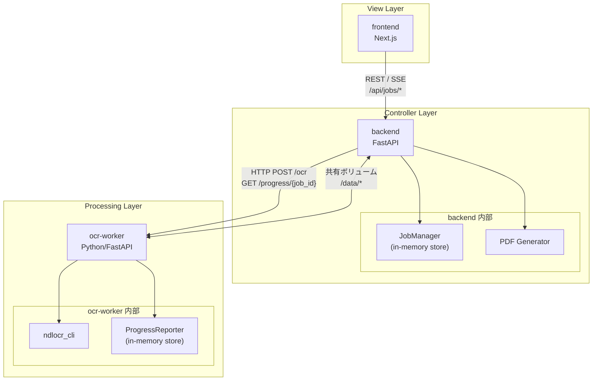
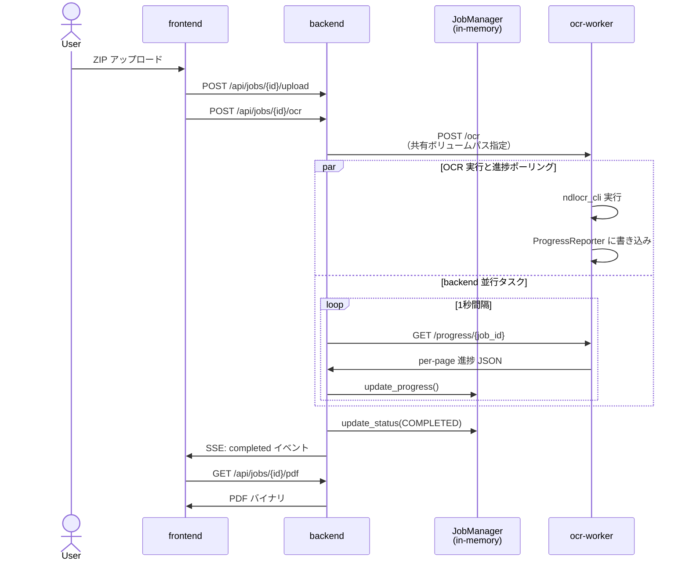
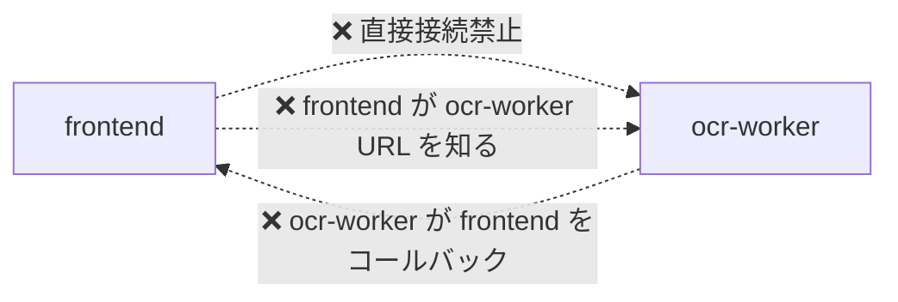

# コンテナ3層構造設計書

> 最終更新: 2026/09/14

---

## 1. 概要

本ドキュメントは book2pdf の Web OCR/PDF システムを構成する3つのコンテナを、厳格な3層アーキテクチャとして整理した設計書です。各層は単一責任を持ち、隣接層とのみ通信することで、将来的なスケーリングや AWS 移行を容易にします。

## 2. 層構成と責務

| 層 | コンテナ | 責務 |
|---|---|---|
| **View 層** | frontend (Next.js) | UI 描画、ユーザー入力、Backend API のみ呼び出し |
| **Controller 層** | backend (FastAPI) | API ゲートウェイ、ジョブ状態管理、OCR Worker 制御、PDF 生成 |
| **Processing 層** | ocr-worker (Python) | ndlocr_cli による OCR 実行、per-page 進捗計算 |

## 3. 結合ルール

1. **frontend は backend のみ通信相手とする**
   - ocr-worker の URL/IP/ポートを知ってはならない。
   - EventSource も `NEXT_PUBLIC_API_BASE_URL`（backend） のみを対象とする。
2. **backend は frontend 向け API と ocr-worker 向け API を分離する**
   - frontend 向け: `/api/jobs/*`（REST + SSE）
   - ocr-worker 向け: `http://ocr-worker:8001/*`（内部 HTTP）
3. **ocr-worker は backend からのリクエストのみ受け付ける**
   - 直接 frontend からの接続を想定しない。
4. **層間データ受け渡しは HTTP API を原則とする**
   - 進捗情報・ジョブメタデータは必ず HTTP で送受信する。
   - 画像/PDF などのバイナリデータは、移行コストを抑えるため現状は Docker 共有ボリュームを許容する。

## 4. アーキテクチャ図

### 4.1 論理構成図

### 4.2 進捗通知データフロー

backend in-memory store をシングルソースとし、frontend は backend のみを参照します。

### 4.3 禁止パターン（anti-pattern）

## 5. ファイル共有の扱い

| 項目 | 方針 | 理由 |
|---|---|---|
| 進捗メタデータ | **HTTP API のみ**（共有ファイルシステム禁止） | 3層分離を維持し、クラウド移行を容易にするため |
| 画像/PDF バイナリ | 現状は Docker 共有ボリュームを使用 | ndlocr_cli がディレクトリパスを要求するため、移行コストを抑える |
| 設定ファイル | 各コンテナイメージに静的包含、または環境変数経由 | 層間の結合を最小化するため |

## 6. 関連ドキュメント

- `docs/SY-PROGRESS-NOTIFICATION-SPEC.md` — 進捗通知方式の全体仕様
- `docs/SY-CONTAINER-PROGRESS-API-DESIGN.md` — REST API 実装レベル仕様
- `docs/SY-STORAGE-MIGRATION-GUIDE.md` — 共有ファイルシステムの AWS 移行方針
