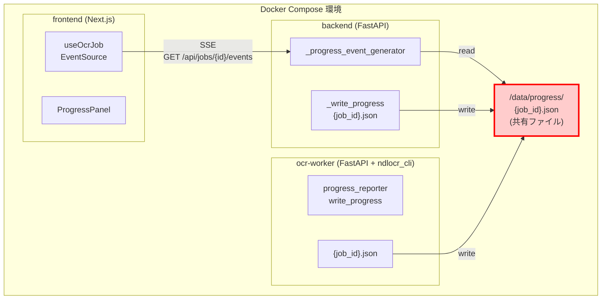
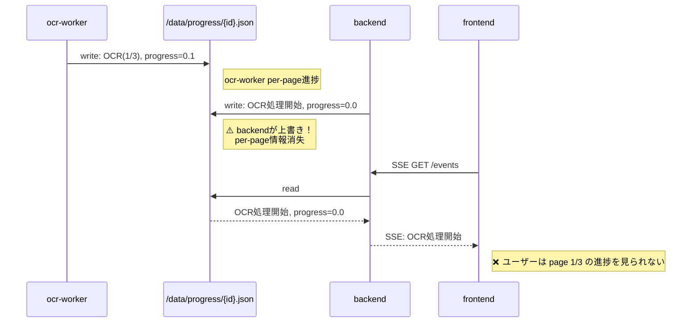
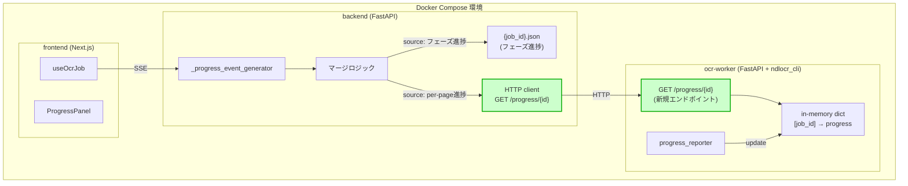
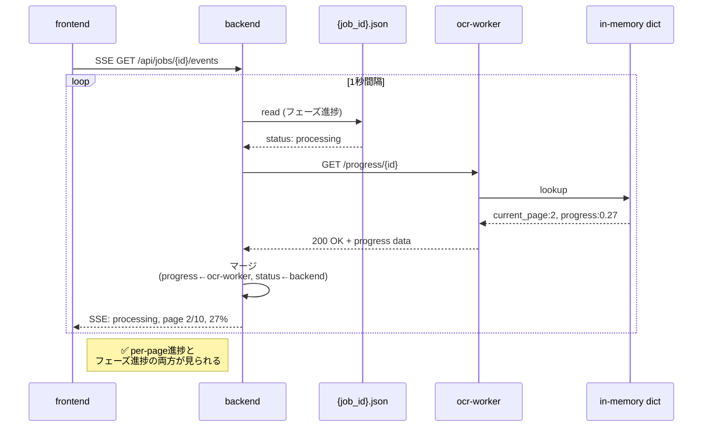
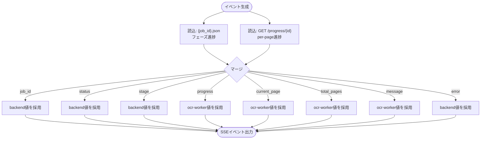

# コンテナ間進捗通知のREST API連携方式設計書

**タスク**: SY002002 — コンテナ間進捗通知のREST API連携方式実装

**関連ドキュメント**:
- `docs/SY-PROGRESS-NOTIFICATION-SPEC.md` — 進捗通知方式全体仕様
- `backend/docs/BE-BACKEND-SYSTEM-SPEC.md` — backend 側実装詳細
- `ocr-worker/docs/OW-OCR-WORKER-SYSTEM-SPEC.md` — ocr-worker 側実装詳細

---

## 1. 背景・目的

OCR 処理は 1 ページあたり数分〜数十分かかる長時間処理です。ユーザーに対して per-page の詳細進捗をリアルタイムに表示する必要があります。

### 問題意識

- **ocr-worker**（OCR エンジン）は「OCR 処理を開始します（1/10）」→「OCR 処理中です（2/10）」といった per-page 進捗を生成します
- **backend**（ジョブ管理）は「OCR 処理を開始しました」「PDF を生成中です」といったジョブフェーズ進捗を管理します
- **現在の方式**では両者が同一ファイル `/data/progress/{job_id}.json` に書き込むため、**ファイル上書きによる競合が発生**しています
- ファイル共有はコンテナ間の疎結合に反し、将来的な別ホスト・別 Pod 移行を阻害します

### 目的

- **ocr-worker** と **backend** の進捗情報交換を REST API に統一する
- コンテナ間の疎結合を実現し、別ホスト・別 Pod 移行を可能にする
- per-page 進捗とジョブフェーズ進捗の両方を同時に表示できるようにする

---

## 2. 現在の方式（ファイル共有ベース）



### データフロー

1. **ocr-worker**: `ndlocr_cli_patches/progress_reporter.py` の `write_progress()` → `/data/progress/{job_id}.json` に per-page 進捗を書き込む
2. **backend**: `jobs.py` の `_write_progress()` → `/data/progress/{job_id}.json` にフェーズ進捗を書き込む
3. **backend**: `_progress_event_generator` → `/data/progress/{job_id}.json` を監視し SSE イベントを生成
4. **frontend**: `useOcrJob` → `EventSource` で SSE を受信し Progress Panel に表示
5. **問題**: 同じファイルに両者が書き込むため、誰かのメッセージが上書きされる

### 競合シナリオ



| 時刻 | イベント | `{job_id}.json` の内容 |
|---|---|---|
| t0 | ocr-worker: page 1/3 開始 | `message:"OCR(1/3)", progress:0.1, current_page:1` |
| t1 | backend: 「OCR処理開始」 | `message:"OCR処理開始", progress:0.0` ← **per-page情報消失** |
| t2 | ocr-worker: page 2/3 開始 | `message:"OCR(2/3)", progress:0.27, current_page:2` |
| t3 | backend: 「PDF生成中」 | `message:"PDF生成中", progress:0.7` ← **per-page情報消失** |

### ファイル共有方式の問題点

| 問題 | 影響 |
|---|---|
| ファイル上書きによる競合 | ocr-worker の per-page 進捗が backend のフェーズ進捗で上書きされ、frontend で詳細進捗が観測できない |
| `current_page` / `progress` の不整合 | 上書きにより値が前後し、UI で進捗が「戻る」現象が発生する |
| 密結合（共有FS必須） | 別ホスト・別 Pod への移行が不可能。Kubernetes では emptyDir/HostPath の制約が生じる |
| ファイルI/O の競合リスク | 両方が同時に書き込む場合、一時ファイルの rename 競合や不完全なファイル読み込みの可能性がある |

---

## 3. 新方式（REST API 連携方式）



### データフロー

1. **ocr-worker**: `progress_reporter` → in-memory `dict[job_id]` に per-page 進捗を蓄積
2. **backend**: `_progress_event_generator` → `GET /progress/{job_id}` を 1秒間隔でポーリング
3. **backend**: `{job_id}.json`（フェーズ進捗）と ocr-worker のレスポンス（per-page進捗）を**マージ**
4. **backend**: マージ結果を SSE イベントとして frontend にプッシュ
5. **frontend**: `useOcrJob` → SSE を受信し Progress Panel に表示

### 正常フロー



### 解決シナリオ（同じ時系列で）

| 時刻 | イベント | backend `{job_id}.json` | ocr-worker `GET /progress` | SSE 出力（マージ後）|
|---|---|---|---|---|
| t0 | ocr-worker: page 1/3 | `status:"processing"` | `current_page:1, progress:0.1` | `status:"processing", current_page:1, progress:0.1` |
| t1 | backend: フェーズ更新 | `status:"processing"` | `current_page:1, progress:0.1` | `status:"processing", current_page:1, progress:0.1` |
| t2 | ocr-worker: page 2/3 | `status:"processing"` | `current_page:2, progress:0.27` | `status:"processing", current_page:2, progress:0.27` |
| t3 | backend: PDF生成開始 | `status:"generating_pdf"` | `current_page:3, progress:0.6` | `status:"generating_pdf", current_page:3, progress:0.6` |

→ **両者の進捗が同時に表示される、上書きなし**

---

## 4. マージ戦略詳細



### フィールド別優先ソース

| フィールド | 優先ソース | 理由 |
|---|---|---|
| `job_id` | backend | ジョブ管理のマスター情報 |
| `status` | backend | ジョブ全体のフェーズ管理責務は backend にある |
| `stage` | backend | 同上（処理段階の管理責務） |
| `progress` | ocr-worker | per-page の細粒度進捗が正確。backend は粗い見積もりしか持たない |
| `current_page` | ocr-worker | OCR エンジンの実測値。backend は把握していない |
| `total_pages` | ocr-worker | 通常は一致。不一致時は ocr-worker の実測値を信頼 |
| `message` | ocr-worker | ユーザー向け詳細メッセージを優先。「OCR(2/10)」などの具体性 |
| `error` | backend | エラー情報は backend が集約・管理する |
| `created_at` / `updated_at` | backend | ジョブ管理の責務 |

### マージロジック（擬似コード）

```python
def merge_progress(phase_data: dict, ocr_data: dict | None) -> dict:
    """フェーズ進捗と per-page 進捗をマージする。"""
    merged = dict(phase_data)  # backend のフェーズ進捗をベースにする

    if ocr_data:
        # ocr-worker の per-page 進捗で上書き
        merged["progress"] = ocr_data.get("progress", merged.get("progress", 0.0))
        merged["current_page"] = ocr_data.get("current_page", merged.get("current_page", 0))
        merged["total_pages"] = ocr_data.get("total_pages", merged.get("total_pages", 0))
        merged["message"] = ocr_data.get("message", merged.get("message", ""))
        # timestamp は ocr-worker のものがより新しい可能性が高い
        if "timestamp" in ocr_data:
            merged["timestamp"] = ocr_data["timestamp"]

    return merged
```

---

## 5. API 仕様

### 5.1 ocr-worker: `GET /progress/{job_id}`

#### リクエスト

```
GET /progress/{job_id}
```

#### レスポンス 200

```json
{
  "job_id": "550e8400-e29b-41d4-a716-446655440000",
  "current_page": 2,
  "total_pages": 10,
  "progress": 0.27,
  "message": "OCR 処理中です（2/10）",
  "timestamp": "2026-09-12T10:30:00Z"
}
```

#### レスポンス 404

```json
{
  "detail": "Job progress not found"
}
```

#### レスポンススキーマ（Pydantic）

```python
class OcrProgressResponse(BaseModel):
    job_id: str
    current_page: int
    total_pages: int
    progress: float  # 0.0 ~ 1.0
    message: str
    timestamp: str   # ISO 8601 format
```

### 5.2 backend: SSE `GET /api/jobs/{job_id}/events`

SSE イベントのペイロードは**マージ後の unified 形式**を維持:

```json
{
  "job_id": "550e8400-e29b-41d4-a716-446655440000",
  "status": "processing",
  "stage": "ocr",
  "progress": 0.27,
  "current_page": 2,
  "total_pages": 10,
  "message": "OCR 処理中です（2/10）"
}
```

### 5.3 backend → ocr-worker ポーリング設定

| 項目 | 設定値 | 理由 |
|---|---|---|
| ポーリング間隔 | 1 秒 | リアルタイム性と負荷のバランス。SSE の更新頻度と同等 |
| HTTP タイムアウト | 5 秒 | ocr-worker の応答は軽い（in-memory lookup）ため短め |
| 初回リトライ待機 | 1 秒 | 瞬断時の早期復旧 |
| 2回目リトライ待機 | 2 秒 | 指数的バックオフ |
| 3回目リトライ待機 | 4 秒 | 指数的バックオフ |
| 最大リトライ回数 | 3 回 | 過度なリトライを防ぐ |
| エラー時の挙動 | ocr-worker データなしでフェーズ進捗のみを SSE で送信 | システム全体の進捗表示を継続させる |

---

## 6. 疎結合効果の比較

| 項目 | Before（ファイル共有） | After（REST API） |
|---|---|---|
| **コンテナ間結合度** | 高い（共有FS必須） | 低い（HTTP通信のみ） |
| **別ホスト移行** | 不可能 | 可能（ホスト名解決のみ） |
| **Kubernetes 対応** | 難しい（emptyDir/HostPath） | 容易（Service Discovery） |
| **単独スケーリング** | 制約あり（共有FSの帯域） | 自由（ocr-worker のみ scale-out 可） |
| **障害分離** | ファイル競合で相互影響 | HTTP タイムアウトで影響限定的 |
| **メッセージ消失** | 発生する（上書き） | なし（両ソース保持） |
| `current_page` の不整合 | 発生する | なし（ocr-worker 値を優先） |
| **テスト容易性** | ファイルシステムのモックが必要 | HTTP クライアントのモックで対応可能 |
| **デバッグ容易性** | ファイル内容を都度確認 | HTTP ログで通信追跡可能 |

---

## 7. 実装結果

### 7.1 ocr-worker（Phase 1）— 完了

1. `ocr-worker/app/main.py` の変更:
   - `OcrProgressResponse` Pydantic モデルを追加
   - `GET /progress/{job_id}` エンドポイントを追加
   - `_write_progress()` の内部動作は in-memory dict (`_progress_store`) への書き込みに変更（ファイル書き込みは削除）

### 7.2 backend（Phase 2）— 完了

1. `backend/app/routers/jobs.py` の変更:
   - `_poll_ocr_worker_progress()` 関数を追加（HTTP クライアントで ocr-worker をポーリング）
   - ファイルベース進捗（`_PROGRESS_DIR`、`{job_id}.json`）を完全に削除
   - `_progress_event_generator()` を in-memory `job_manager.get_progress()` と ocr-worker の `GET /progress/{job_id}` をマージする方式に再実装
   - マージ戦略を実装（フィールド別優先ソース: `progress` / `current_page` / `message` は ocr-worker 優先、`status` は backend 優先）
   - オフライン時のフォールバック（フェーズ進捗のみ送信）
   - デッドコード `_POLL_INTERVAL` / `PROGRESS_POLL_INTERVAL` を削除

2. `backend/app/services/ocr_engine.py` の変更:
   - ocr-worker へのリクエストに `enable_progress: False` を送信し、独立した進捗管理を維持

3. `backend/tests/conftest.py` の変更:
   - `PROGRESS_DIR`、`PROGRESS_POLL_INTERVAL`、`_test_progress_dir` の不要な設定を削除

### 7.3 テスト（Phase 3）— 完了

1. `backend/tests/test_progress.py` の更新:
   - backend only / merged / worker 404 / worker timeout / completed / failed / heartbeat の 7 テストを追加・修正し全件 PASS

2. `backend/tests/test_ocr.py` の更新:
   - `test_run_ocr_writes_staged_progress` を in-memory `job_manager.get_progress()` 検証に書き換え

3. `frontend` の更新:
   - backend の SSE 出力形式に変更がないため変更なし

---

## 8. 今後の拡張

| 拡張案 | 内容 |
|---|---|
| **WebSocket 方式の検討** | 双方向通信が必要になった場合（例: ユーザーからの処理キャンセル信号） |
| **進捗の永続化** | ocr-worker の in-memory dict を Redis などに移行し、プロセス再起動時の情報保持 |
| **複数 ocr-worker 対応** | backend が複数の ocr-worker インスタンスを管理し、ロードバランシング |
| **進捗の履歴化** | 各ページの処理時間を蓄積し、予測残り時間の表示 |

---

## 9. 関連ドキュメント

- `docs/SY-PROGRESS-NOTIFICATION-SPEC.md` — 進捗通知方式全体仕様（SSE / HTTP ポーリング）
- `backend/docs/BE-BACKEND-SYSTEM-SPEC.md` — backend 側の実装詳細
- `ocr-worker/docs/OW-OCR-WORKER-SYSTEM-SPEC.md` — ocr-worker 側の実装詳細
- `frontend/docs/FE-FRONTEND-SYSTEM-SPEC.md` — frontend 側の実装詳細
