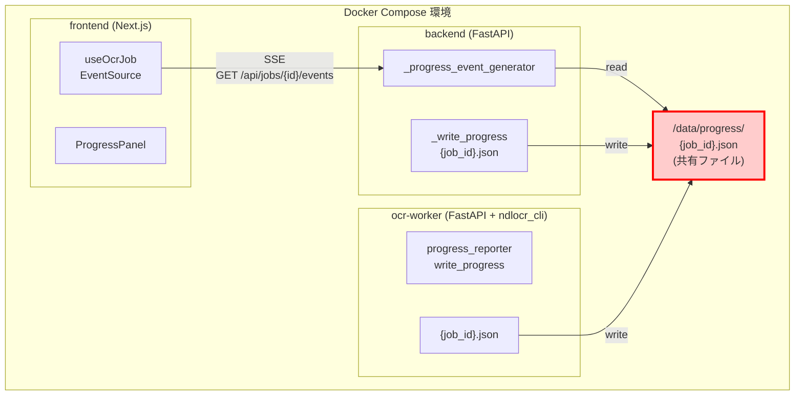
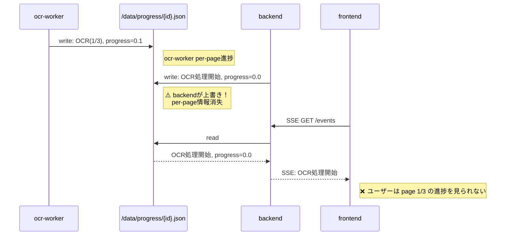
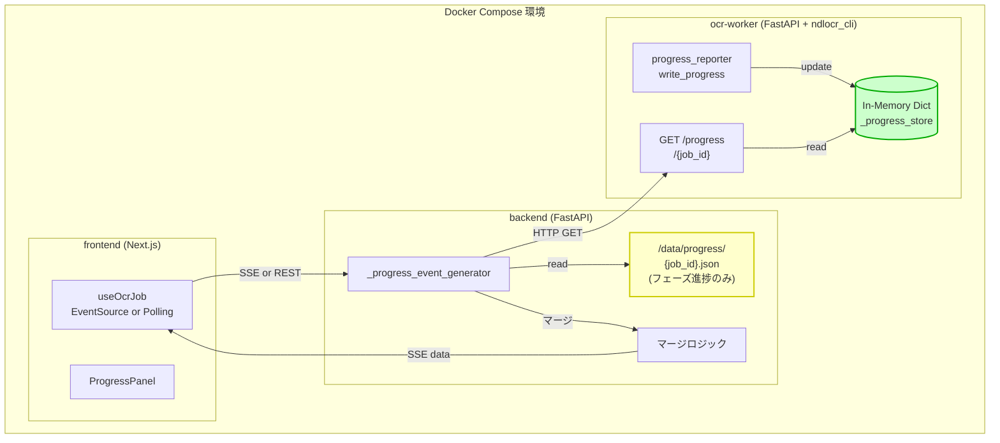
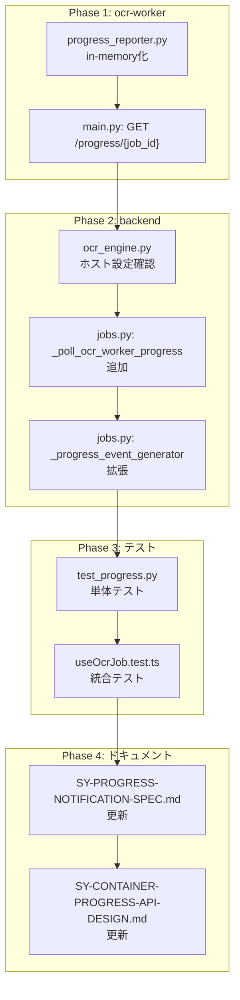
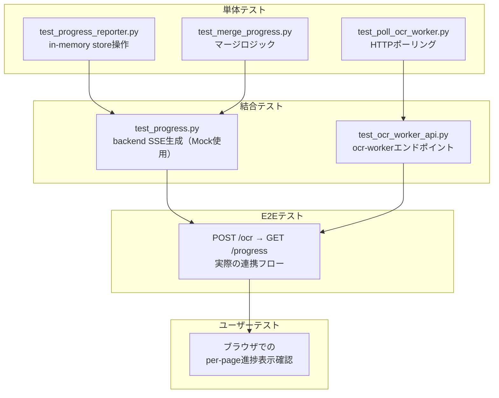

# コンテナ間進捗通知のREST API連携方式設計書

**タスク**: SY002002 — コンテナ間進捗通知のREST API連携方式実装

本ドキュメントは、`docs/SY-PROGRESS-NOTIFICATION-SPEC.md` で定めた進捗通知方式の**実装レベル仕様書**です。REST API エンドポイント定義・リクエスト/レスポンススキーマ・エラーハンドリング・実装計画・テスト方針を厳密に定義します。

**関連ドキュメント**:
- `docs/SY-PROGRESS-NOTIFICATION-SPEC.md` — 進捗通知方式全体仕様（方式選択論・アーキテクチャ概説）
- `backend/docs/BE-BACKEND-SYSTEM-SPEC.md` — backend 側実装詳細
- `ocr-worker/docs/OW-OCR-WORKER-SYSTEM-SPEC.md` — ocr-worker 側実装詳細

---

## 1. 背景・目的

OCR 処理は 1 ページあたり数分〜数十分かかる長時間処理です。ユーザーに対して per-page の詳細進捗をリアルタイムに表示する必要があります。

### 問題意識

- **ocr-worker**（OCR エンジン）は「OCR 処理を開始します（1/10）」→「OCR 処理中です（2/10）」といった per-page 進捗を生成します
- **backend**（ジョブ管理）は「OCR 処理を開始しました」「PDF を生成中です」といったジョブフェーズ進捗を管理します
- **現在の方式**では両者が同一ファイル `/data/progress/{job_id}.json` に書き込むため、**ファイル上書きによる競合が発生**しています
- ファイル共有はコンテナ間の疎結合に反し、将来的な別ホスト・別 Pod 移行を阻害します

### 目的

- **ocr-worker** と **backend** の進捗情報交換を REST API に統一する
- コンテナ間の疎結合を実現し、別ホスト・別 Pod 移行を可能にする
- per-page 進捗とジョブフェーズ進捗の両方を同時に表示できるようにする

---

## 2. 現在の方式（ファイル共有ベース）

### 2.1 アーキテクチャ（Before）



### 2.2 競合シナリオ



### 2.3 ファイル共有方式の問題点

| 問題 | 影響 |
|---|---|
| ファイル上書きによる競合 | ocr-worker の per-page 進捗が backend のフェーズ進捗で上書きされ、frontend で詳細進捗が観測できない |
| `current_page` / `progress` の不整合 | 上書きにより値が前後し、UI で進捗が「戻る」現象が発生する |
| 密結合（共有FS必須） | 別ホスト・別 Pod への移行が不可能。Kubernetes では emptyDir/HostPath の制約が生じる |
| ファイルI/O の競合リスク | 両方が同時に書き込む場合、一時ファイルの rename 競合や不完全なファイル内容の読み取りが発生しうる |

---

## 3. REST API 連携方式（After）

### 3.1 アーキテクチャ



### 3.2 データフロー

1. **ocr-worker**: `progress_reporter.write_progress()` → `_progress_store[job_id]` に per-page 進捗を in-memory 更新
2. **ocr-worker**: `GET /progress/{job_id}` → `_progress_store` から per-page 進捗を JSON で返す
3. **backend**: `_progress_event_generator` → 1秒間隔で ocr-worker `GET /progress/{job_id}` を HTTP ポーリング
4. **backend**: `_progress_event_generator` → 同時に `/data/progress/{job_id}.json` を読み込み（フェーズ進捗）
5. **backend**: マージロジック → ocr-worker per-page + backend フェーズ → unified progress
6. **backend**: `StreamingResponse` → SSE イベントとして frontend に配信
7. **frontend**: `useJobProgress` / `useOcrJob` → SSE または REST ポーリングで受信

---

## 4. REST API エンドポイント詳細

### 4.1 共通仕様

#### ベース URL

| モジュール | ベース URL | 備考 |
|---|---|---|
| backend | `http://localhost:8000` | frontend / localapp から参照 |
| ocr-worker | `http://localhost:5001` | backend から内部参照（frontend からは直接アクセス不可） |

#### 認証

現段階では認証を実装していない。将来的に Bearer Token (JWT) 方式を導入予定。

#### 共通エラーレスポンス形式

```json
{
  "detail": "エラーメッセージ",
  "error_code": "ERROR_CODE",
  "timestamp": "2026-09-13T10:00:00Z"
}
```

### 4.2 ocr-worker: `GET /progress/{job_id}`

#### 概要

ocr-worker 内部の `_progress_store` から per-page 進捗データを取得します。このエンドポイントは backend からのみ呼び出され、frontend からは直接アクセスしません。

#### リクエスト

| 項目 | 値 |
|---|---|
| メソッド | `GET` |
| パス | `/progress/{job_id}` |
| パスパラメータ | `job_id` (UUID) — ジョブの一意識別子 |
| ヘッダー | `Accept: application/json` |
| クエリ | なし |
| リクエストボディ | なし |

#### 正常レスポンス（200 OK）

```json
{
  "job_id": "550e8400-e29b-41d4-a716-446655440000",
  "current_page": 2,
  "total_pages": 10,
  "progress": 0.27,
  "message": "OCR 処理中です（2/10）",
  "timestamp": "2026-09-13T10:30:00Z"
}
```

**フィールド詳細**:

| フィールド | 型 | 必須 | 説明 |
|---|---|---|---|
| `job_id` | string (UUID) | Yes | ジョブ ID |
| `current_page` | integer | Yes | 現在処理中のページ番号（1-based） |
| `total_pages` | integer | Yes | 総ページ数 |
| `progress` | float | Yes | 進捗率（0.0 ~ 1.0） |
| `message` | string | Yes | 進捗メッセージ（表示用） |
| `timestamp` | string (ISO 8601) | Yes | 進捗更新時刻 |

#### エラーレスポンス

| ステータス | 条件 | レスポンス例 |
|---|---|---|
| `404 Not Found` | `job_id` に対応する進捗データが存在しない | `{"detail": "Job progress not found"}` |
| `400 Bad Request` | `job_id` の形式が不正 | `{"detail": "Invalid job_id format"}` |
| `500 Internal Server Error` | 内部エラー | `{"detail": "Internal server error"}` |

#### Pydantic スキーマ

```python
class OcrProgressResponse(BaseModel):
    job_id: str = Field(..., description="ジョブの一意識別子")
    current_page: int = Field(..., ge=0, description="現在処理中のページ番号（1-based）")
    total_pages: int = Field(..., ge=1, description="総ページ数")
    progress: float = Field(..., ge=0.0, le=1.0, description="進捗率")
    message: str = Field(..., description="進捗メッセージ")
    timestamp: str = Field(..., description="進捗更新時刻（ISO 8601）")

    class Config:
        json_schema_extra = {
            "example": {
                "job_id": "550e8400-e29b-41d4-a716-446655440000",
                "current_page": 2,
                "total_pages": 10,
                "progress": 0.27,
                "message": "OCR 処理中です（2/10）",
                "timestamp": "2026-09-13T10:30:00Z"
            }
        }
```

### 4.3 backend: `GET /api/jobs/{job_id}`

#### 概要

指定したジョブの最新状態を JSON で取得します。REST ポーリング方式の primary エンドポイントです。

#### リクエスト

| 項目 | 値 |
|---|---|
| メソッド | `GET` |
| パス | `/api/jobs/{job_id}` |
| パスパラメータ | `job_id` (UUID) |
| ヘッダー | `Accept: application/json` |

#### 正常レスポンス（200 OK）

```json
{
  "id": "550e8400-e29b-41d4-a716-446655440000",
  "status": "processing",
  "stage": "ocr",
  "progress": 0.27,
  "current_page": 2,
  "total_pages": 10,
  "message": "OCR 処理中です（2/10）",
  "files": ["page001.png", "page002.png", "page003.png"],
  "created_at": "2026-09-13T09:00:00Z",
  "updated_at": "2026-09-13T10:30:00Z"
}
```

**フィールド詳細**:

| フィールド | 型 | 必須 | 説明 |
|---|---|---|---|
| `id` | string (UUID) | Yes | ジョブ ID |
| `status` | string | Yes | ジョブ状態：`pending`, `uploaded`, `processing`, `completed`, `failed` |
| `stage` | string | No | 処理フェーズ：`uploaded`, `ocr-started`, `ocr-complete`, `pdf-generating`, `done` |
| `progress` | float | No | 進捗率（0.0 ~ 1.0）。ocr-worker データが未反映の場合は null または 0.0 |
| `current_page` | integer | No | 現在処理中のページ番号（1-based） |
| `total_pages` | integer | No | 総ページ数 |
| `message` | string | No | 進捗メッセージ |
| `files` | string[] | No | アップロードされたファイル名リスト |
| `created_at` | string (ISO 8601) | Yes | ジョブ作成時刻 |
| `updated_at` | string (ISO 8601) | Yes | 最終更新時刻 |

#### エラーレスポンス

| ステータス | 条件 | レスポンス例 |
|---|---|---|
| `404 Not Found` | ジョブが存在しない | `{"detail": "Job not found"}` |
| `400 Bad Request` | `job_id` の形式が不正 | `{"detail": "Invalid job_id format"}` |
| `500 Internal Server Error` | 内部エラー | `{"detail": "Internal server error"}` |

### 4.4 backend: SSE `GET /api/jobs/{job_id}/events`

#### 概要

指定したジョブの進捗を Server-Sent Events (SSE) 形式でストリーミング配信します。

#### リクエスト

| 項目 | 値 |
|---|---|
| メソッド | `GET` |
| パス | `/api/jobs/{job_id}/events` |
| パスパラメータ | `job_id` (UUID) |
| ヘッダー | `Accept: text/event-stream` |

#### SSE イベント形式

```text
data: {"status":"processing","current_page":2,"total_pages":10,"progress":0.27,"message":"OCR 処理中です（2/10）","timestamp":"2026-09-13T10:30:00Z"}

event: done
data: {"type":"done","timestamp":"2026-09-13T10:35:00Z"}
```

**イベント種別**:

| event 名 | 用途 | ペイロード例 |
|---|---|---|
| （デフォルト） | 進捗更新 | `{"status":"processing","current_page":2,"total_pages":10,"progress":0.27,"message":"OCR 2/10"}` |
| `keep-alive` | ハートビート | `{"type":"heartbeat","timestamp":"2026-09-13T10:30:00Z"}` |
| `done` | ストリーム終了 | `{"type":"done","timestamp":"2026-09-13T10:35:00Z"}` |

#### SSE ペイロードスキーマ（統合形式）

```json
{
  "job_id": "550e8400-e29b-41d4-a716-446655440000",
  "status": "processing",
  "stage": "ocr",
  "progress": 0.27,
  "current_page": 2,
  "total_pages": 10,
  "message": "OCR 処理中です（2/10）",
  "timestamp": "2026-09-13T10:30:00Z"
}
```

**フィールド詳細**:

| フィールド | 型 | 必須 | ソース | 説明 |
|---|---|---|---|---|
| `job_id` | string (UUID) | Yes | backend | ジョブ ID |
| `status` | string | Yes | backend | ジョブ状態 |
| `stage` | string | No | backend | 処理フェーズ |
| `progress` | float | No | **ocr-worker優先** | 進捗率。ocr-worker データがあればその値、なければ backend 推定値 |
| `current_page` | integer | No | **ocr-worker優先** | 現在ページ |
| `total_pages` | integer | No | **ocr-worker優先** | 総ページ数 |
| `message` | string | No | **ocr-worker優先** | 進捗メッセージ。ocr-worker が未設定時は backend メッセージ |
| `timestamp` | string (ISO 8601) | Yes | backend | マージ時点のサーバー時刻 |

#### エラーハンドリング

```mermaid
flowchart TD
    A[frontend<br/>EventSource接続] --> B{HTTP ステータス}
    B -->|200| C[SSEストリーム開始]
    B -->|404| D[ジョブ未存在エラー<br/>UIに表示]
    B -->|500| E[サーバーエラー<br/>指数バックオフでリトライ]
    C --> F{SSE切断<br/>発生？}
    F -->|Yes| G{同一job_idで<br/>再接続？}
    G -->|Yes| H[指数バックオフ<br/>(base=1s, max=4s)]
    H --> A
    G -->|No| I[接続終了]
    F -->|No| J{doneイベント<br/>受信？}
    J -->|Yes| K[ストリーム完了]<br/>接続終了]
    J -->|No| L[次のイベント待機]
    L --> F
```

### 4.5 backend: `POST /api/jobs`

#### 概要

新規ジョブを作成します。

#### リクエスト

| 項目 | 値 |
|---|---|
| メソッド | `POST` |
| パス | `/api/jobs` |
| ヘッダー | `Content-Type: application/json` |
| リクエストボディ | `{"name": "optional_job_name"}` または空 `{}` |

#### 正常レスポンス（201 Created）

```json
{
  "id": "550e8400-e29b-41d4-a716-446655440000",
  "status": "pending",
  "created_at": "2026-09-13T09:00:00Z",
  "updated_at": "2026-09-13T09:00:00Z"
}
```

### 4.6 backend: `POST /api/jobs/{job_id}/upload`

#### 概要

指定したジョブに ZIP ファイルをアップロードします。

#### リクエスト

| 項目 | 値 |
|---|---|
| メソッド | `POST` |
| パス | `/api/jobs/{job_id}/upload` |
| パスパラメータ | `job_id` (UUID) |
| ヘッダー | `Content-Type: multipart/form-data` |
| リクエストボディ | `file: <binary ZIP>` |

#### 正常レスポンス（200 OK）

```json
{
  "id": "550e8400-e29b-41d4-a716-446655440000",
  "status": "uploaded",
  "files": ["page001.png", "page002.png"],
  "message": "Uploaded 2 files",
  "updated_at": "2026-09-13T09:05:00Z"
}
```

### 4.7 backend: `POST /api/jobs/{job_id}/ocr`

#### 概要

指定したジョブの OCR 処理を開始します。

#### リクエスト

| 項目 | 値 |
|---|---|
| メソッド | `POST` |
| パス | `/api/jobs/{job_id}/ocr` |
| パスパラメータ | `job_id` (UUID) |
| ヘッダー | `Content-Type: application/json` |
| リクエストボディ | 空 `{}` またはオプション設定 |

#### 正常レスポンス（202 Accepted）

```json
{
  "id": "550e8400-e29b-41d4-a716-446655440000",
  "status": "processing",
  "stage": "ocr-started",
  "message": "OCR 処理を開始しました",
  "updated_at": "2026-09-13T09:10:00Z"
}
```

### 4.8 backend: `GET /api/jobs/{job_id}/pdf`

#### 概要

指定したジョブの生成済み PDF をダウンロードします。

#### リクエスト

| 項目 | 値 |
|---|---|
| メソッド | `GET` |
| パス | `/api/jobs/{job_id}/pdf` |
| パスパラメータ | `job_id` (UUID) |
| ヘッダー | `Accept: application/pdf` |

#### 正常レスポンス（200 OK）

- `Content-Type: application/pdf`
- ボディ: PDF バイナリ

#### エラーレスポンス

| ステータス | 条件 |
|---|---|
| `404 Not Found` | PDF が未生成、またはジョブが存在しない |
| `400 Bad Request` | `job_id` の形式が不正 |

---

## 5. マージ戦略詳細

### 5.1 マージ対象フィールド

| フィールド | 優先ソース | 理由 | ocr-worker 未応答時の挙動 |
|---|---|---|---|
| `progress` | **ocr-worker** | per-page の処理進捗は ocr-worker のみが正確に把握 | backend の推定値（フェーズに応じた固定値）を使用 |
| `current_page` | **ocr-worker** | 同上 | `null`（UI で非表示） |
| `total_pages` | **ocr-worker** または backend | 両方で同一値を期待 | backend の値を使用 |
| `message` | **ocr-worker** | per-page メッセージ（`OCR 2/10`）を優先 | backend のフェーズメッセージを使用 |
| `status` | **backend** | `processing` / `completed` / `failed` は backend が権威情報 | backend の値を使用 |
| `stage` | **backend** | 処理フェーズは backend が管理 | backend の値を使用 |

### 5.2 マージロジック（疑似コード）

```python
def merge_progress(backend_progress: dict, ocr_progress: dict | None) -> dict:
    """
    backend のフェーズ進捗と ocr-worker の per-page 進捗をマージする
    """
    merged = {
        "job_id": backend_progress["job_id"],
        "status": backend_progress["status"],           # backend 優先
        "stage": backend_progress.get("stage"),          # backend 優先
        "timestamp": datetime.utcnow().isoformat(),      # マージ時点
    }

    if ocr_progress:
        # ocr-worker データが存在する場合は優先
        merged["progress"] = ocr_progress.get("progress", backend_progress.get("progress", 0.0))
        merged["current_page"] = ocr_progress.get("current_page")
        merged["total_pages"] = ocr_progress.get("total_pages", backend_progress.get("total_pages"))
        merged["message"] = ocr_progress.get("message", backend_progress.get("message", ""))
    else:
        # ocr-worker 未応答時は backend データのみ
        merged["progress"] = backend_progress.get("progress", 0.0)
        merged["current_page"] = backend_progress.get("current_page")
        merged["total_pages"] = backend_progress.get("total_pages")
        merged["message"] = backend_progress.get("message", "")

    return merged
```

### 5.3 メッセージ優先ルール

| 条件 | 優先メッセージ | 例 |
|---|---|---|
| ocr-worker に `message` があり、かつ `current_page` > 0 | ocr-worker | `OCR 処理中です（2/10）` |
| ocr-worker に `message` が空 | backend | `OCR 処理を開始しました` |
| backend の `stage` が `pdf-generating` | backend | `PDF を生成中です` |
| backend の `status` が `failed` | backend | `処理中にエラーが発生しました` |

---

## 6. Polling設定

### 6.1 backend → ocr-worker 内部ポーリング

| 項目 | 設定値 | 理由 |
|---|---|---|
| ポーリング間隔 | **1 秒** | リアルタイム性と負荷のバランス。SSE の更新頻度と同等 |
| HTTP タイムアウト | **5 秒** | ocr-worker の応答は軽い（in-memory lookup）ため短め |
| 初回リトライ待機 | **1 秒** | 瞬断時の早期復旧 |
| 2回目リトライ待機 | **2 秒** | 指数的バックオフ |
| 3回目リトライ待機 | **4 秒** | 指数的バックオフ |
| 最大リトライ回数 | **3 回** | 過度なリトライを防ぐ |
| エラー時の挙動 | ocr-worker データなしでフェーズ進捗のみを SSE で送信 | システム全体の進捗表示を継続させる |

### 6.2 frontend/backend REST ポーリング

| 項目 | 設定値 | 理由 |
|---|---|---|
| ポーリング間隔 | **2 秒** (`processing` 時) | per-page 進捗を観測するため短め |
| ポーリング間隔 | **2 秒** (`pending`/`uploaded` 時) | 早期段階の応答性確保 |
| HTTP タイムアウト | **10 秒** | ネットワーク遅延を考慮 |
| 最大ポーリング時間 | `ページ数 × page_timeout_sec` | タイムアウト判定用 |

---

## 7. 実装計画

### 7.1 実装フェーズ依存関係



### 7.2 ocr-worker（Phase 1）実装詳細

1. **`ocr-worker/ndlocr_cli_patches/progress_reporter.py`** 変更:
   - `_progress_store: dict[str, dict]` をグローバルに追加
   - `write_progress()` をファイル書き込みから in-memory dict 更新に変更
   - 既存のファイル書き込みは削除（backend のフェーズ進捗ファイルとの競合を避けるため）

2. **`ocr-worker/app/main.py`** 変更:
   - `OcrProgressResponse` Pydantic モデルを追加
   - `GET /progress/{job_id}` エンドポイントを追加
   - `_write_progress()` の呼び出しを維持（互換性のため、ただし内部動作が変わる）

### 7.3 backend（Phase 2）実装詳細

1. **`backend/app/routers/jobs.py`** 変更:
   - `_poll_ocr_worker_progress()` 関数を追加（HTTP クライアントで ocr-worker をポーリング）
   - `_progress_event_generator()` を拡張:
     - `/data/progress/{job_id}.json`（フェーズ進捗）の監視を維持
     - ocr-worker の `GET /progress/{job_id}` を 1秒間隔でポーリング
     - 両ソースをマージして SSE イベントを生成
   - マージ戦略を実装（フィールド別優先ソース）
   - オフライン時のフォールバック（フェーズ進捗のみ送信）

2. **`backend/app/services/ocr_engine.py`** 変更:
   - ocr-worker のホスト・ポート設定を確認・必要に応じて更新
   - デフォルト値: `OCR_WORKER_HOST=ocr-worker`, `OCR_WORKER_PORT=5001`

---

## 8. 疎結合効果の比較

| 項目 | Before（ファイル共有） | After（REST API） |
|---|---|---|
| **コンテナ間結合度** | 高い（共有FS必須） | 低い（HTTP通信のみ） |
| **別ホスト移行** | 不可能 | 可能（ホスト名解決のみ） |
| **Kubernetes 対応** | 難しい（emptyDir/HostPath） | 容易（Service Discovery） |
| **単独スケーリング** | 制約あり（共有FSの帯域） | 自由（ocr-worker のみ scale-out 可） |
| **障害分離** | ファイル競合で相互影響 | HTTP タイムアウトで影響限定的 |
| **メッセージ消失** | 発生する（上書き） | なし（両ソース保持） |
| `current_page` の不整合 | 発生する | なし（ocr-worker 値を優先） |
| **テスト容易性** | ファイルシステムのモックが必要 | HTTP クライアントのモックで対応可能 |
| **デバッグ容易性** | ファイル内容を都度確認 | HTTP ログで通信追跡可能 |

---

## 9. テスト方針

### 9.1 テスト層構成



### 9.2 必須テスト項目

#### ocr-worker 単体テスト

| テスト名 | 内容 | 期待結果 |
|---|---|---|
| `test_write_progress_updates_store` | `write_progress()` で `_progress_store` が更新される | store に正しいデータが格納される |
| `test_get_progress_returns_data` | `GET /progress/{job_id}` で store のデータが返る | 200 + 正しい JSON |
| `test_get_progress_not_found` | 存在しない job_id で GET | 404 |
| `test_progress_isolation` | 異なる job_id のデータが混在しない | 各 job_id で独立したデータ |

#### backend 単体テスト

| テスト名 | 内容 | 期待結果 |
|---|---|---|
| `test_merge_ocr_worker_priority` | ocr-worker データがある場合のマージ | progress/current_page/message が ocr-worker 値 |
| `test_merge_backend_fallback` | ocr-worker 未応答時のマージ | status/stage は backend、progress は backend 値 |
| `test_poll_ocr_worker_success` | `_poll_ocr_worker_progress()` の正常応答 | 正しい dict を返す |
| `test_poll_ocr_worker_timeout` | `_poll_ocr_worker_progress()` のタイムアウト | None を返し、エラーログを出力 |
| `test_generator_emits_merged_events` | `_progress_event_generator` がマージデータを SSE で配信 | SSE イベントに ocr-worker per-page データが含まれる |

#### E2E テスト

| テスト名 | 内容 | 期待結果 |
|---|---|---|
| `test_ocr_job_shows_per_page_progress` | 実際の ZIP をアップロード・OCR 実行 | frontend で `1/3` → `2/3` → `3/3` と段階的に進捗が更新される |
| `test_ocr_worker_api_direct` | `POST /ocr` 後に `GET /progress/{job_id}` を直接確認 | ocr-worker API が per-page 進捗を返す |

---

## 10. 今後の拡張

| 拡張案 | 内容 | 優先度 |
|---|---|---|
| **WebSocket 方式の検討** | 双方向通信が必要になった場合（例: ユーザーからの処理キャンセル信号） | 低 |
| **進捗の永続化** | ocr-worker の in-memory dict を Redis などに移行し、プロセス再起動時の情報保持 | 中 |
| **複数 ocr-worker 対応** | backend が複数の ocr-worker インスタンスを管理し、ロードバランシング | 低 |
| **進捗の履歴化** | 各ページの処理時間を蓄積し、予測残り時間の表示 | 中 |
| **API 認証（JWT）** | Bearer Token 方式でのエンドポイント保護 | 中 |
| **OpenAPI（Swagger）自動生成** | FastAPI の `/docs` エンドポイントを充実させ、API 仕様を自動ドキュメント化 | 高 |

---

## 11. 関連ドキュメント

- `docs/SY-PROGRESS-NOTIFICATION-SPEC.md` — 進捗通知方式全体仕様（SSE / HTTP ポーリングの方式選択論・アーキテクチャ概説）
- `backend/docs/BE-BACKEND-SYSTEM-SPEC.md` — backend 側の実装詳細
- `ocr-worker/docs/OW-OCR-WORKER-SYSTEM-SPEC.md` — ocr-worker 側の実装詳細
- `frontend/docs/FE-FRONTEND-SYSTEM-SPEC.md` — frontend 側の実装詳細
