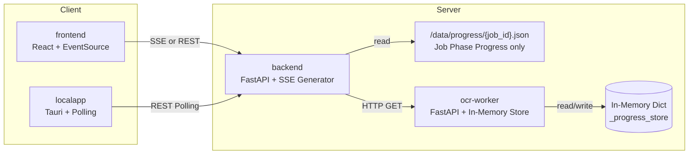
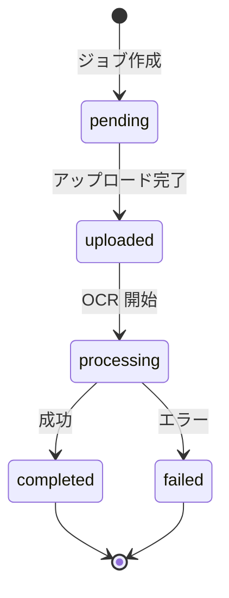
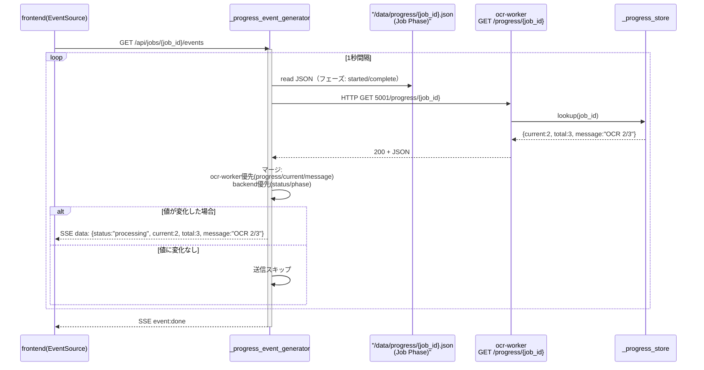
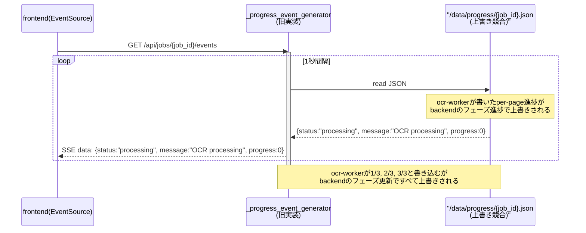
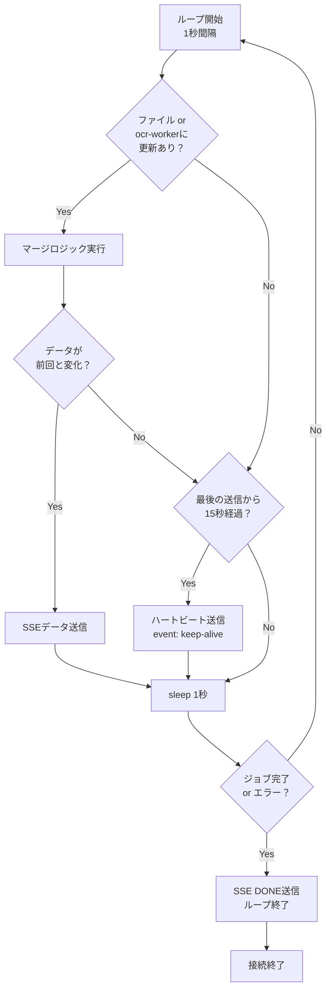
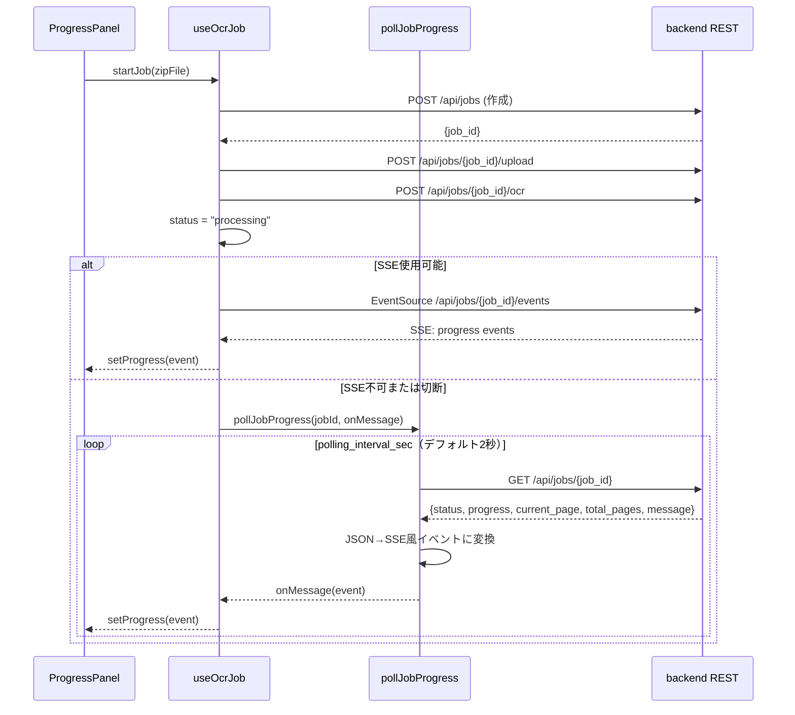
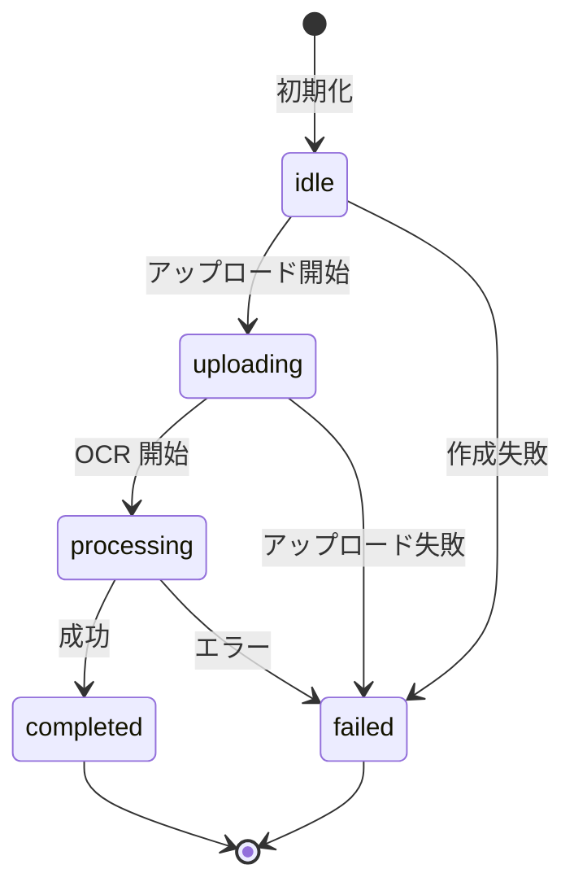
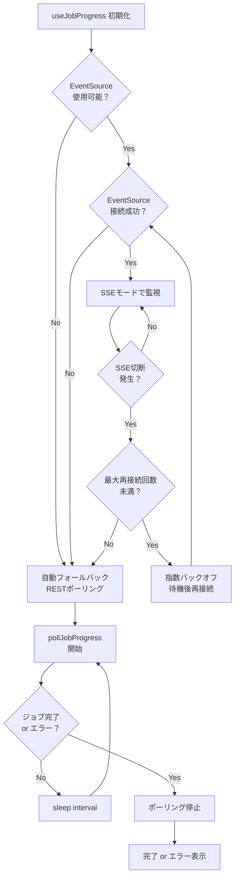

# 進捗通知方式仕様書

> 最終更新: 2026/09/13
本ドキュメントは、book2pdf プロジェクトにおける OCR 処理ジョブの進捗通知方式（SSE と REST ポーリング）の**全体設計書**です。`frontend`、`backend`、`localapp`、`ocr-worker` の各モジュールが共通して参照し、方式選択論・システムアーキテクチャ・動作概説を定義します。

実装レベルの REST API エンドポイント定義・スキーマ詳細は、`docs/SY-CONTAINER-PROGRESS-API-DESIGN.md` を参照してください。

---

## 1. 概要・目的・設計原則

### 1.1 目的

OCR 処理は 1 ページあたり数分〜数十分かかる長時間処理です。ユーザーに対して適切な進捗を表示し、処理が完了したこと・失敗したことを通知する仕組みが必要です。

### 1.2 設計原則：コンテナ間疎結合

- **ファイル共有は禁止原則**：各コンテナ（backend / ocr-worker）が同一ホストのファイルシステムに依存する設計は、将来の別ホスト・別 Pod 移行を阻害します。
- **REST/API 連携必須**：ocr-worker の進捗を backend が参照する場合、必ず HTTP REST API 経由とします。
- **backend が統合窓口**：frontend / localapp は backend API のみを参照し、ocr-worker を直接知らないようにします。

---

## 2. システムアーキテクチャ

### 2.1 コンポーネント構成



### 2.2 責務分担

| モジュール | 責務 |
|---|---|
| `frontend` | ブラウザ上で SSE (`EventSource`) で接続を試行し、失敗時は REST ポーリングにフォールバック。progress UI を表示する。 |
| `localapp` | Tauri WebView 内では `EventSource` が不安定なため、原則として REST ポーリングを使用。Rust 側が `GET /api/jobs/{job_id}` をポーリングし、`ocr-progress` イベントをフロントエンドへ中継する。 |
| `backend` | ジョブ状態管理、SSE エンドポイント (`/api/jobs/{job_id}/events`) 配信、`GET /api/jobs/{job_id}` による状態問い合わせ。`_progress_event_generator` はファイル進捗と ocr-worker REST API の両方を監視・マージして SSE イベントを生成する。 |
| `ocr-worker` | `ndlocr_cli_patches` からの per-page 進捗メッセージを in-memory dict (`_progress_store`) に格納し、`GET /progress/{job_id}` で外部に公開する。 |

---

## 3. 方式比較マトリックス

| 項目 | SSE | REST ポーリング | ファイル共有（旧方式） | WebSocket |
|---|---|---|---|---|
| **リアルタイム性** | 高い（サーバーからプッシュ） | 中（クライアントが問い合わせ） | 中（ファイルポーリング） | 高い（双方向） |
| **プロキシ環境** | 一部で切断・遅延の可能性 | 一般的に安定 | N/A（同一ホスト前提） | プロキシで切断される可能性 |
| **実装コスト** | 中（再接続・heartbeat管理） | 低い | 低い（単純だが脆弱） | 高い |
| **疎結合性** | 高い（HTTPベース） | 高い（HTTPベース） | **低い**（同一FS依存） | 高い |
| **使用対象** | Web ブラウザ（proxy なし環境） | Web ブラウザ（proxy あり）、localapp | **非推奨（旧方式）** | 将来的に検討 |
| **主な用途** | デフォルト方式 | SSE不可時のフォールバック | — | 双方向通信が必要時 |

---

## 4. ジョブ状態遷移

### 4.1 状態定義

| 状態 | 意味 |
|---|---|
| `pending` | ジョブ作成直後、ファイル未アップロード |
| `uploaded` | ZIP ファイルアップロード完了、OCR 未実行 |
| `processing` | OCR 処理実行中（backend / ocr-worker 非同期実行中） |
| `completed` | OCR と PDF 生成が完了 |
| `failed` | 処理中にエラーが発生 |

### 4.2 状態遷移図



---

## 5. backend SSE 詳細設計

### 5.1 理想動作（ocr-worker REST 連携版）



### 5.2 現状の問題（ファイル共有のみ・ocr-worker REST 未連携）



**症結**: ocr-worker が per-page 進捗（`1/3`, `2/3`）を書き込んでも、backend のジョブフェーズ更新（`started` / `completed`）ですべて上書きされ、frontend では `0%` → `完了` の飛躍しか観測できない。

### 5.3 内部ループ・フローチャート



### 5.4 マージ戦略（フィールド別優先順位）

| フィールド | 優先ソース | 理由 |
|---|---|---|
| `progress`（進捗率 0.0〜1.0） | **ocr-worker** | per-page の処理進捗は ocr-worker のみが正確に把握している |
| `current`（現在ページ） | **ocr-worker** | 同上 |
| `total`（総ページ数） | **backend** または ocr-worker | 両方で同一値が期待される。不一致時は ocr-worker を優先 |
| `message`（進捗メッセージ） | **ocr-worker** | per-page メッセージ（`OCR 2/3`）を優先。ocr-worker が未設定時のみ backend メッセージを使用 |
| `status`（ジョブ状態） | **backend** | `processing` / `completed` / `failed` は backend が権威情報 |
| `phase`（処理フェーズ） | **backend** | `uploaded` / `ocr-started` / `ocr-complete` / `pdf-generating` / `done` は backend フェーズ |
| `timestamp` | **backend** | マージ時点でのサーバー時刻 |

### 5.5 イベント種別

| event 名 | 用途 | データ例 |
|---|---|---|
| `data`（デフォルト） | 進捗更新 | `{"status":"processing","current":2,"total":3,"message":"OCR 2/3","progress":0.67}` |
| `keep-alive` | ハートビート（接続維持） | `{"type":"heartbeat","timestamp":"2026-09-13T10:00:00Z"}` |
| `done` | ストリーム終了 | `{"type":"done","timestamp":"2026-09-13T10:05:00Z"}` |

---

## 6. frontend REST ポーリング方式

### 6.1 シーケンス図



### 6.2 useOcrJob 状態遷移図



### 6.3 SSE → フォールバック フロー



### 6.4 ポーリング設定

| 状態 | 推奨間隔 | 理由 |
|---|---|---|
| `processing` | 2 秒 | サーバー負荷とリアルタイム性のバランス。per-page 進捗を観測するため短め。 |
| `pending` / `uploaded` | 2 秒 | 早期段階では短くして応答性を確保 |
| 完了直後 | 即座に取得 | `completed`/`failed` を検知したらポーリング停止 |

### 6.5 最大ポーリング時間

- 設定ファイル `~/.config/book2pdf/settings.json` の `page_timeout_sec`（1 ページあたりのタイムアウト）に基づく
- 計算式: `推定最大時間 = ページ数 × page_timeout_sec`
- デフォルト: `page_timeout_sec = 600`（10 分/ページ）
- 推定最大時間を超えても `completed`/`failed` に至らない場合、クライアントはユーザーに対して「タイムアウトしました。backend の状態を確認してください」と表示する

---

## 7. 責務分担まとめ

### 7.1 backend

- `GET /api/jobs/{job_id}/events` は `StreamingResponse` で SSE を返す
- 進捗情報は in-memory `job_manager.get_progress()` と ocr-worker の `GET /progress/{job_id}` をマージして参照する（ファイルベースの共有は廃止）
- 両ソースをマージして SSE イベントを生成し、統一されたペイロードでフロントエンドに配信する
- `GET /api/jobs/{job_id}` は通常の JSON レスポンスを返す

### 7.2 frontend

- まず SSE (`EventSource`) で接続を試行する
- SSE 接続失敗・切断時は自動的に `GET /api/jobs/{job_id}` へのポーリングに切り替える
- ユーザー設定または環境検出で「常にポーリングを使用」モードを提供してもよい
- 進捗表示コンポーネントは SSE/ポーリングの差異を吸収し、統一されたイベントオブジェクトを受け取る
- **REST ポーリング時、frontend は `/data/progress/{job_id}.json` を直接参照してはならない** — backend API 経由のみとする

### 7.3 localapp

- Tauri の WebView 内では `EventSource` が使えない、または不安定な場合がある
- 原則として `GET /api/jobs/{job_id}` へのポーリングを使用する
- Rust 側 (`backend_api_impl.rs`) がポーリングを実行し、`ocr-progress` イベントをフロントエンドに emit する
- フロントエンド (`backendApiStore.ts`) は `ocr-progress` イベントを購読し、進捗 UI を更新する

---

## 8. 設定項目

`~/.config/book2pdf/settings.json`（localapp）および frontend の設定 UI で以下をユーザーが変更可能にする。

```json
{
  "backend_url": "http://localhost:8000",
  "polling_interval_sec": 2,
  "page_timeout_sec": 600,
  "http_client_timeout_sec": 60,
  "upload_timeout_sec": 600,
  "ocr_request_timeout_sec": 60,
  "poll_request_timeout_sec": 10,
  "prefer_sse": true,
  "sse_reconnect_max_retries": 3,
  "sse_reconnect_base_delay_sec": 1
}
```

| キー | 型 | デフォルト | 説明 |
|---|---|---|---|
| `backend_url` | string | `http://localhost:8000` | backend API のベース URL |
| `polling_interval_sec` | integer | `2` | ポーリング間隔（秒） |
| `page_timeout_sec` | integer | `600` | 1 ページあたりのタイムアウト（秒） |
| `http_client_timeout_sec` | integer | `60` | HTTP クライアント全体のデフォルトタイムアウト（秒） |
| `upload_timeout_sec` | integer | `600` | ZIP アップロード時の個別タイムアウト（秒） |
| `ocr_request_timeout_sec` | integer | `60` | OCR 実行依頼の個別タイムアウト（秒） |
| `poll_request_timeout_sec` | integer | `10` | ジョブ状態取得の個別タイムアウト（秒） |
| `prefer_sse` | boolean | `true` | frontend で SSE を優先して試行するか |
| `sse_reconnect_max_retries` | integer | `3` | SSE 切断時の最大再接続回数 |
| `sse_reconnect_base_delay_sec` | integer | `1` | SSE 再接続の指数バックオフ基準秒数 |

---

## 9. 今後の拡張

- WebSocket 方式の検討（双方向通信が必要になった場合）
- 進捗の詳細化（ページ単位の処理段階ごとの予測残り時間、ページあたりの処理速度統計）
- ジョブ一覧画面での複数ジョブ進捗表示
- マルチテナント環境への対応（namespace / tenant 分離）

---

## 10. 関連ドキュメント

- `docs/SY-CONTAINER-PROGRESS-API-DESIGN.md` — REST API 実装レベル仕様（エンドポイント・スキーマ詳細）
- `backend/docs/BE-BACKEND-SYSTEM-SPEC.md` — backend 側の実装詳細
- `frontend/docs/FE-FRONTEND-SYSTEM-SPEC.md` — frontend 側の実装詳細
- `localapp/docs/LA-LOCALAPP-SPEC.md` — localapp 側の実装詳細
- `docs/SY-WEB-OCR-SYSTEM-PLAN.md` — 全体アーキテクチャ
