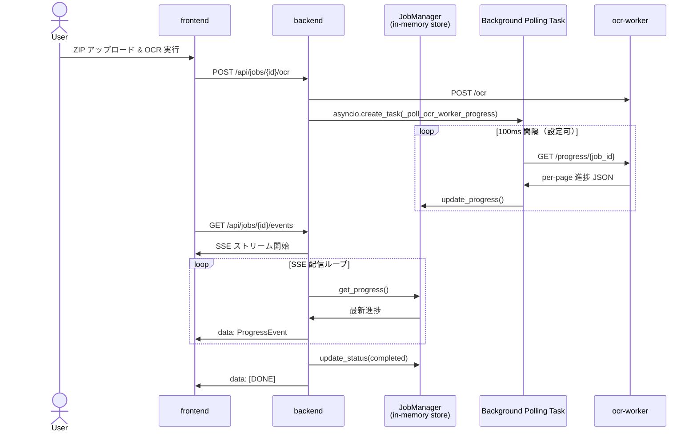

# 進捗配信 SSE 解説書

> 最終更新: 2026/09/14

---

## 1. 概要

本ドキュメントは、book2pdf の Web OCR/PDF システムにおいて、backend から frontend へ OCR ジョブの進捗をリアルタイムに配信するための **Server-Sent Events（SSE）** 方式について解説します。

## 2. SSE とは

Server-Sent Events（SSE）は、HTTP 接続を維持したままサーバーからクライアントへ一方向にテキストメッセージをプッシュする Web 標準技術です。

```text
HTTP/1.1 200 OK
Content-Type: text/event-stream
Cache-Control: no-cache
Connection: keep-alive

data: {"job_id":"...","status":"processing","progress":0.2,...}\n\n
: keepalive\n\n
data: [DONE]\n\n
```

### 2.1 SSE を選んだ理由

| 方式 | リアルタイム性 | 双方向性 | プロキシ親和性 | 実装コスト | 備考 |
|---|---|---|---|---|---|
| **SSE** | ◎ | 不要（サーバー→クライアントのみ） | ◎ | 低 | HTTP/1.1 で動作、Nginx でも設定が容易 |
| WebSocket | ◎ | 双方向 | △ | 中 | ファイアウォール・ロードバランサーで追加設定が必要 |
| Long Polling | △ | 不要 | ◎ | 低 | オーバーヘッドが大きく遅延が大きい |

進捗配信は「サーバー→クライアント」の一方向通信で十分なため、SSE を採用しています。

## 3. アーキテクチャ

本システムでは、backend の in-memory store をシングルソースとし、SSE はその変更を検知して配信するだけの役割を持ちます。



## 4. プロトコル詳細

### 4.1 エンドポイント

| メソッド | パス | 説明 |
|---|---|---|
| `GET` | `/api/jobs/{job_id}/events` | SSE ストリームを返す |
| `GET` | `/api/jobs/{job_id}/progress` | 現在の進捗スナップショットを JSON で返す（REST ポーリング用） |

### 4.2 HTTP レスポンスヘッダー

```http
Content-Type: text/event-stream
Cache-Control: no-cache
X-Accel-Buffering: no
Connection: keep-alive
```

- `Cache-Control: no-cache` — プロキシやブラウザがレスポンスをキャッシュしないようにします。
- `X-Accel-Buffering: no` — Nginx 等のリバースプロキシが SSE ストリームをバッファリングしないようにします。

### 4.3 イベント形式

```text
data: {"job_id":"abc123","status":"processing","progress":0.25,"current_page":1,"total_pages":4,"message":"OCR 処理中です（1/4）","timestamp":"2026-09-14T10:00:00+00:00"}

```

### 4.4 終了シグナル

完了または失敗時に以下を送信し、ストリームを終了します。

```text
data: [DONE]

```

## 5. ハートビート（keepalive）

進捗が変化しない間も、接続がタイムアウトしないようコメント行を定期的に送信します。

```text
: keepalive

```

| 設定名 | デフォルト値 | 説明 |
|---|---|---|
| `_HEARTBEAT_INTERVAL` | 15.0 秒 | ハートビート送信間隔 |

## 6. リトライ・再接続

### 6.1 frontend の再接続動作

`EventSource` は接続が切れた場合、自動的に再接続を試みます。デフォルトの `retry` 間隔はブラウザ実装依存ですが、本システムでは独自の指数バックオフを併用します。

```typescript
const RETRY_DELAYS_MS = [1000, 2000, 4000, 8000, 16000];
```

### 6.2 推奨する再接続パターン

```mermaid
graph LR
    A[EventSource 接続] --> B{エラー発生？}
    B -->|いいえ| C[継続受信]
    B -->|はい| D[指数バックオフで再接続]
    D --> A
    C --> E[[DONE] 受信？]
    E -->|はい| F[接続終了]
    E -->|いいえ| C
```

## 7. エラーハンドリング

### 7.1 SSE 接続エラー

- `EventSource.onerror` でエラーを検知
- エラー時は REST ポーリング fallback に切り替え
- 指数バックオフで再接続を試行

### 7.2 ジョブ完了・失敗判定

| イベント | 判定方法 |
|---|---|
| 完了 | `status === "completed"` または `[DONE]` 受信 |
| 失敗 | `status === "failed"` または `[DONE]` 受信 |

### 7.3 error_code 予約欄

`ProgressEvent` モデルには将来の拡張のため `error_code` を予約しています。

```typescript
interface ProgressEvent {
  job_id: string;
  status: "pending" | "uploaded" | "processing" | "completed" | "failed";
  progress: number;
  current_page: number;
  total_pages: number;
  message: string;
  timestamp: string;
  error_code?: string;  // 将来の拡張用
}
```

## 8. backend 実装

### 8.1 FastAPI StreamingResponse

```python
@router.get("/{job_id}/events")
async def stream_job_events(job_id: str) -> StreamingResponse:
    job = job_manager.get_job(job_id)
    if job is None:
        raise HTTPException(status_code=404, detail="指定されたジョブが見つかりません")

    return StreamingResponse(
        _progress_event_generator(job_id),
        media_type="text/event-stream",
        headers={
            "Cache-Control": "no-cache",
            "X-Accel-Buffering": "no",
        },
    )
```

### 8.2 進捗ジェネレータ

```python
async def _progress_event_generator(job_id: str):
    last_data = None
    while True:
        data = job_manager.get_progress(job_id)
        if data is None:
            await asyncio.sleep(0.1)
            continue

        if data != last_data:
            last_data = data.copy()
            event = ProgressEvent(
                job_id=job_id,
                status=JobStatus(data["status"]),
                progress=data.get("progress", 0.0),
                current_page=data.get("current_page", 0),
                total_pages=data.get("total_pages", 0),
                message=data.get("message", ""),
                timestamp=data.get("timestamp", ""),
            )
            yield f"data: {event.model_dump_json()}\n\n"

            if data["status"] in (JobStatus.COMPLETED.value, JobStatus.FAILED.value):
                yield "data: [DONE]\n\n"
                break

        await asyncio.sleep(_SSE_POLL_INTERVAL)
```

## 9. frontend 実装

### 9.1 EventSource の使用例

```typescript
const eventSource = new EventSource(`/api/jobs/${jobId}/events`);

eventSource.onmessage = (event) => {
  if (event.data === "[DONE]") {
    eventSource.close();
    return;
  }
  const progress: ProgressEvent = JSON.parse(event.data);
  updateProgress(progress);
};

eventSource.onerror = () => {
  // 接続エラー時は REST ポーリング fallback に切り替え
  switchToPollingFallback(jobId);
};
```

### 9.2 REST ポーリング fallback

```typescript
const pollProgress = async (jobId: string) => {
  const response = await fetch(`/api/jobs/${jobId}/progress`);
  if (!response.ok) return;
  const progress: ProgressEvent = await response.json();
  updateProgress(progress);
  if (progress.status !== "completed" && progress.status !== "failed") {
    setTimeout(() => pollProgress(jobId), PROGRESS_POLL_INTERVAL_MS);
  }
};
```

## 10. セキュリティ

- **CORS**: frontend オリジンからの SSE 接続を許可する。
- **認証**: 将来的には `Authorization` ヘッダーを EventSource のカスタムヘッダーとして設定するか、URL クエリパラメーターで一時トークンを渡す。
- **レート制限**: 同一クライアントからの過度な接続を防ぐ。

## 11. テスト

| テスト項目 | 検証内容 |
|---|---|
| SSE 接続確立 | `GET /events` が `text/event-stream` を返す |
| 進捗イベント配信 | `job_manager.update_progress()` → `onmessage` イベント到達 |
| ハートビート | 15 秒経過後も接続が維持される |
| 終了シグナル | 完了時に `[DONE]` が送信され接続が閉じられる |
| エラー fallback | `onerror` 発生時に REST ポーリングに切り替わる |

## 12. トラブルシューティング

| 症状 | 原因 | 対処 |
|---|---|---|
| SSE イベントが届かない | リバースプロキシのバッファリング | `X-Accel-Buffering: no` を確認 |
| 接続が頻繁に切れる | プロキシのタイムアウト | ハートビート間隔を短縮 |
| `[DONE]` 受信後も再接続する | frontend の再接続ロジックが `onerror` を発火 | `[DONE]` 受信時に `eventSource.close()` を確認 |

## 13. 関連ドキュメント

- `docs/SY-PROGRESS-NOTIFICATION-SPEC.md` — 進捗通知方式の全体仕様
- `docs/SY-CONTAINER-PROGRESS-API-DESIGN.md` — REST API 実装レベル仕様
- `docs/SY-CONTAINER-3LAYER-ARCHITECTURE.md` — コンテナ3層構造設計書
