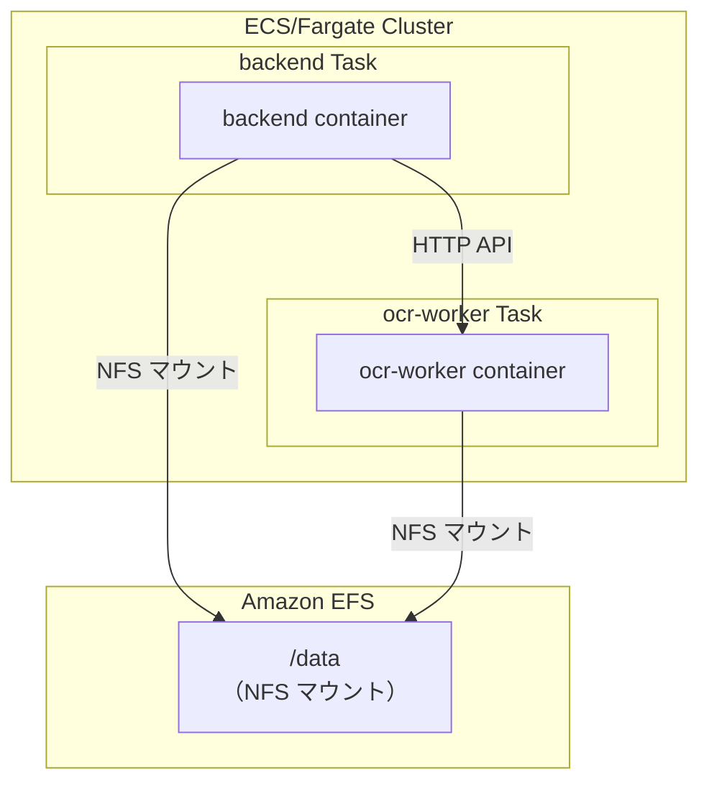
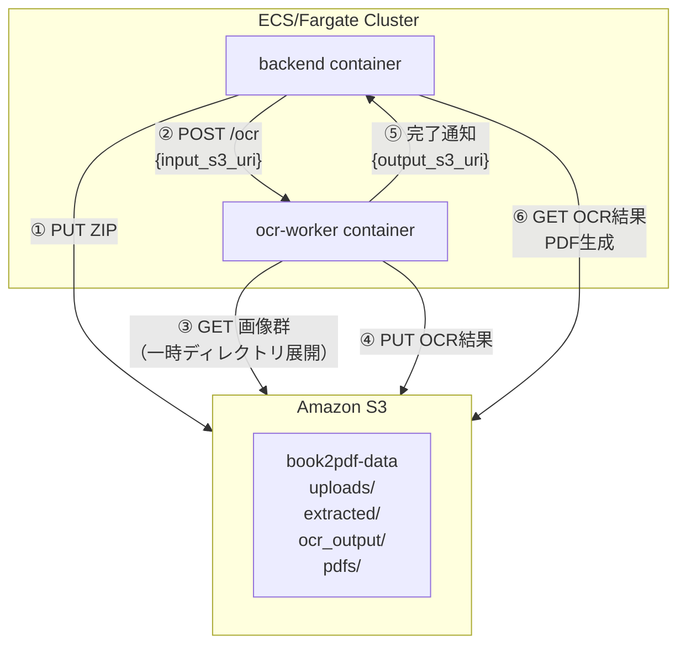
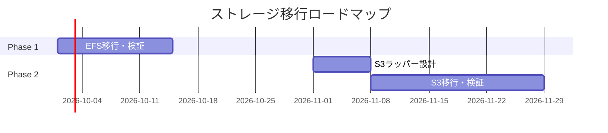

# 共有ファイルシステム代替方針（AWS 移行時）

> 最終更新: 2026/09/14

---

## 1. 概要

本ドキュメントは、book2pdf の backend と ocr-worker が共有している Docker ボリューム（`/data/*`）を、AWS 上で Amazon EFS または Amazon S3 に移行する際の方針をまとめたものです。

## 2. 現状の共有ファイルシステム分析

### 2.1 Docker Compose 構成

```yaml
services:
  backend:
    volumes:
      - uploads:/data/uploads
      - extracted:/data/extracted
      - ocr_output:/data/ocr_output
      - pdfs:/data/pdfs
  ocr-worker:
    volumes:
      - uploads:/data/uploads
      - extracted:/data/extracted
      - ocr_output:/data/ocr_output
      - pdfs:/data/pdfs
```

### 2.2 各ディレクトリの用途

| ボリューム | マウントパス | 用途 | 主な入出力方向 |
|---|---|---|---|
| `uploads` | `/data/uploads` | アップロードされた ZIP ファイルの保存 | backend ← frontend |
| `extracted` | `/data/extracted` | ZIP 展開後の画像ファイル群の保存 | backend → ocr-worker |
| `ocr_output` | `/data/ocr_output` | OCR 結果（XML・テキスト）の保存 | ocr-worker → backend |
| `pdfs` | `/data/pdfs` | 生成された PDF ファイルの保存 | backend → frontend |

### 2.3 ファイル共有が必要な理由

- **ndlocr_cli のインターフェース制約**: `input_root`（ディレクトリパス）と `output_root`（ディレクトリパス）を要求する。
- **入出力フォーマット**: 単一ファイルではなく、画像群 + XML/テキスト群のディレクトリ構造を扱う。

## 3. 代替候補比較

| 項目 | Amazon EFS | Amazon S3 |
|---|---|---|
| インターフェース | NFS（ファイルシステムマウント） | REST API（オブジェクトストレージ） |
| コード変更量 | **ほぼ不要**（パスを維持できる） | **大**（ダウンロード/アップロードラッパー必須） |
| ndlocr_cli 対応 | そのまま使用可能 | 一時ディレクトリ展開が必要 |
| スケーラビリティ | 制限あり | 無制限に近い |
| コスト | ストレージ量 + スループット | ストレージ量 + リクエスト数 + 転送量 |
| サーバーレス化 | 困難（マウント必須） | 容易（Pre-signed URL 等） |

## 4. EFS 移行案（推奨：Phase 1）

### 4.1 アーキテクチャ図



### 4.2 必要な変更

1. `docker-compose.yml` の `volumes` を **ECS タスク定義の `volumes`（EFS）** に変更する。
2. コンテナ内のパス `/data/*` はそのまま維持する。
3. **アプリケーションコードは変更しない**。

## 5. S3 移行案（Phase 2）

### 5.1 アーキテクチャ図



### 5.2 必要な変更

| 層 | 変更内容 |
|---|---|
| **backend** | `POST /ocr` のペイロードに S3 URI（`s3://bucket/extracted/{job_id}/`）を含める |
| **ocr-worker** | 処理前: S3 から一時ディレクトリへダウンロード<br/>処理後: 結果を S3 にアップロード |
| **ocr-worker** | ndlocr_cli のラッパーを追加し、`input_root`/`output_root` を一時ディレクトリにマッピング |

## 6. 推奨ロードマップ



## 7. 結論

- **即座の AWS 移行**: EFS を使用し、コード変更を最小化する。
- **中長期的な最適化**: ndlocr_cli ラッパー完成後、S3 へ段階的に移行する。
- **進捗メタデータ**: HTTP API のみを使用し、ストレージ移行の対象外とする。

## 8. 関連ドキュメント

- `docs/SY-CONTAINER-3LAYER-ARCHITECTURE.md` — コンテナ3層構造設計書
- `docs/SY-PROGRESS-NOTIFICATION-SPEC.md` — 進捗通知方式の全体仕様
