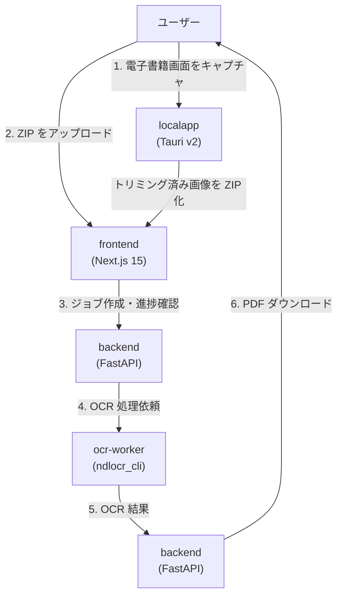

# Web OCR/PDF システム 全体計画書

本ドキュメントは、book2pdf プロジェクト全体において、各モジュールが協調して実現する最終的なアプリケーション機能と全体アーキテクチャをまとめたものです。

> 最終更新: 2026/09/14

---

## 1. プロジェクト概要

- **目的**: 電子書籍のページ画像から OCR 処理を行い、検索可能 PDF を生成する
- **対象コンテンツ**: 電子書籍リーダー上で表示されたページ画像
- **学習目的**: Next.js / FastAPI / Docker / Rust / Tauri の習得
- **方針**: 既存の `old/` フォルダのソースコード・ドキュメントは一切参照せず、スクラッチで開発する

## 2. システム全体構成

本プロジェクトは以下の 2 つのシステムで構成されます。

| システム | 用途 | 技術スタック | 担当モジュール |
|---|---|---|---|
| ローカルスタンドアローンアプリ | 電子書籍画面のキャプチャ＋不要部分のトリミング | Tauri v2 + Rust + React + Vite | `localapp/` |
| Web OCR/PDF システム | ZIP 画像 → OCR → 検索可能 PDF 生成 | Next.js 15 + FastAPI + Docker + ndlocr_cli | `frontend/` / `backend/` / `ocr-worker/` |

各システムの選定理由や非機能要件などの詳細は `docs/SY-DESIGN-DECISIONS.md` を参照してください。

### 2.1 ドキュメント構成

本プロジェクトのドキュメントは、プロジェクト全体の設計と各モジュール固有の設計に分けて管理します。

| 種別 | 配置先 | 主な内容 |
|---|---|---|
| 全体設計・決定事項 | `./docs/` | プロジェクト全体の方針、アーキテクチャ、技術選定 |
| 全体横断のタスク・作業ログ・注意事項 | `./docs/` | 複数モジュールにまたがるタスク管理、作業ログ、注意事項 |
| backend 固有 | `backend/docs/` | backend のタスク管理、環境構築ログ、詳細計画 |
| frontend 固有 | `frontend/docs/` | frontend のタスク管理、環境構築ログ、詳細計画 |
| localapp 固有 | `localapp/docs/` | localapp のタスク管理、環境構築ログ、詳細計画 |
| ocr-worker 固有 | `ocr-worker/docs/` | ocr-worker のタスク管理、環境構築ログ、詳細計画 |

各モジュールの `docs/` には `OT-TASKS.md`（タスク管理表）、`OT-WORK-LOG.md`（作業ログ）、`OT-CAVEATS.md`（注意事項）を配置します。複数モジュールにまたがる内容は `./docs/` 配下に配置します。詳細な運用ルールは `./.clinerules` を参照してください。

## 3. 全体アーキテクチャ



## 4. 各モジュールの責務

### 4.1 `localapp/`（ローカルスタンドアローンアプリ）

- 電子書籍リーダーの画面をキャプチャする
- キャプチャ画像から外枠などの不要部分をトリミングする
- トリミング済み画像を ZIP アーカイブにまとめて保存する
- Web システムへアップロードするための入出力ファイルを提供する

### 4.2 `frontend/`（Web フロントエンド）

- ブラウザ上で ZIP アーカイブをアップロードする UI を提供する
- OCR 処理ジョブの進捗状況をリアルタイムで表示する
- OCR 完了後に生成された検索可能 PDF をダウンロードする UI を提供する
- 必要に応じて、進捗通知のフォールバック（ポーリング）にも対応する

### 4.3 `backend/`（Web バックエンド）

- アップロードされた ZIP を受け取り、画像を展開する
- OCR ジョブを発行し、ジョブ状態を管理する
- `ocr-worker` を通じて ndlocr_cli による OCR 処理を実行する
- OCR 結果をもとに検索可能 PDF を生成する
- 処理進捗を `frontend` へ通知する
- 生成した PDF をダウンロードできるようにする

### 4.4 `ocr-worker/`（OCR 実行モジュール）

- ndlocr_cli を Python パッケージとして実行する環境を提供する
- `backend` から受け取った画像に対して OCR 処理を行う
- 日本語縦書き・ルビ・複雑な和書レイアウトにも対応した OCR 結果を返す

## 5. 全体処理フロー

1. ユーザーは `localapp` で電子書籍ページをキャプチャし、不要部分をトリミングする
2. `localapp` はトリミング済み画像を ZIP アーカイブにまとめて保存する
3. ユーザーはブラウザで `frontend` を開き、ZIP をアップロードする
4. `frontend` は `backend` にアップロードし、ジョブ ID を取得する
5. `backend` は ZIP を展開し、ジョブ状態を管理する
6. `backend` は `ocr-worker` に OCR 処理を依頼する
7. `ocr-worker` が ndlocr_cli を実行し、OCR 結果を返す
8. `backend` は OCR 結果をもとに検索可能 PDF を生成する
9. 処理進捗は SSE またはポーリングで `frontend` に通知される
10. ユーザーは `frontend` から完成した PDF をダウンロードする

## 6. 最終的に実現する機能

### 6.1 電子書籍ページのキャプチャと前処理

- 画面キャプチャによるページ画像の取得
- 不要な枠線や余白の自動・手動トリミング
- 複数ページの画像を ZIP アーカイブにまとめる

### 6.2 ZIP アーカイブのアップロードとジョブ管理

- ブラウザからの ZIP アップロード
- ジョブ ID の発行と状態管理
- ジョブ一覧・詳細の確認

### 6.3 OCR 処理

- ndlocr_cli を用いた高精度な日本語 OCR
- 縦書き・横書きのテキスト検出
- ルビ・複雑レイアウトへの対応（段階的）

### 6.4 検索可能 PDF の生成

- 元のページ画像を背景とする PDF
- OCR 結果の座標情報に基づく透明テキストレイヤーの配置
- ブラウザからの PDF ダウンロード

### 6.5 進捗通知

- リアルタイムな処理進捗の表示
- プロキシ環境への対応として SSE と HTTP ポーリングの両方を定義
- 詳細は [`docs/SY-PROGRESS-NOTIFICATION-SPEC.md`](SY-PROGRESS-NOTIFICATION-SPEC.md) を参照

## 7. 技術選定の概要

| レイヤー | 技術 | 理由 |
|---|---|---|
| ローカルアプリ | Tauri v2 + Rust + React + Vite | クロスプラットフォーム対応、軽量、画面キャプチャプラグインが利用可能 |
| Web フロントエンド | Next.js 15 App Router | モダン Web 技術の学習、SSR/SSG/Route Handlers の実践 |
| Web バックエンド | FastAPI | Python 製 OCR ライブラリとの親和性が高い、非同期処理が得意 |
| OCR | ndlocr_cli | 日本語縦書き・ルビ・複雑レイアウトに強い国立国会図書館製 OCR |
| PDF 生成 | PyMuPDF | 画像背景＋透明テキストレイヤーの検索可能 PDF 作成に向いている |
| コンテナ | Docker + Docker Compose | 環境の再現性、OS 依存の排除 |

各技術の詳細な選定理由や実行環境については `docs/SY-DESIGN-DECISIONS.md` を参照してください。

## 8. 初期実装範囲

### 8.1 今回の初期実装で採用する方式

| 項目 | 初期実装 |
|---|---|
| ジョブ状態管理 | メモリ内（辞書） |
| 進捗通知 | Server-Sent Events (SSE） |
| テキスト方向 | 横書きを優先し、縦書きは段階的に対応 |
| OCR 実行 | Python パッケージとして `import` して関数を呼び出す |

### 8.2 採用理由

- メモリ内管理：実装がシンプルで、学習初期に集中できる
- SSE：リアルタイム性があり、FastAPI との相性が良い
- 横書き優先：縦書き PDF 生成は高度な処理となるため、まず横書きで動作確認してから段階的に対応する

## 9. 将来の課題・拡張

以下は今回の初期実装では対応せず、次のステップで検討・実装する課題として記録します。

### 9.1 ジョブ状態の永続化

- **目標**: SQLite に永続化
- **理由**: プロセス再起動後もジョブ状態を保持し、複数 worker 間での状態共有を可能にする

### 9.2 進捗通知方式の見直し

- **目標**: localapp / frontend のポーリング方式を整備
- **理由**: プロキシ環境やタイムアウト設定によって SSE が不安定になる場合への対応
- **詳細**: [`docs/SY-PROGRESS-NOTIFICATION-SPEC.md`](SY-PROGRESS-NOTIFICATION-SPEC.md)

### 9.3 縦書き・複雑レイアウトの本格対応

- **目標**: 縦書きテキストやルビを含むページでも正しい検索可能 PDF を生成
- **理由**: 和書電子書籍への対応範囲を広げるため

## 10. システム関連ファイル構成

```
book2pdf/
├── backend/                                 # FastAPI バックエンド
│   ├── Dockerfile                           # コンテナイメージ定義
│   ├── README.md                            # backend 概要
│   ├── requirements.txt                     # Python 依存パッケージ
│   ├── run.py                               # 開発用起動スクリプト
│   ├── app/                                 # アプリケーションコード
│   │   ├── __init__.py                      # パッケージ初期化
│   │   ├── main.py                          # FastAPI アプリケーションエントリ
│   │   ├── core/                            # 横断設定
│   │   │   ├── __init__.py                  # パッケージ初期化
│   │   │   └── config.py                    # 環境変数・設定管理
│   │   ├── models/                          # Pydantic / DB モデル
│   │   │   ├── __init__.py                  # パッケージ初期化
│   │   │   └── job.py                       # OCR ジョブモデル
│   │   ├── routers/                         # API エンドポイント
│   │   │   ├── __init__.py                  # パッケージ初期化
│   │   │   └── jobs.py                      # /jobs エンドポイント
│   │   └── services/                        # ビジネスロジック
│   │       ├── __init__.py                  # パッケージ初期化
│   │       ├── job_manager.py               # ジョブ管理
│   │       ├── ocr_engine.py                # OCR エンジン連携
│   │       ├── pdf_generator.py             # PDF 生成
│   │       ├── xml_parser.py                # NDL OCR XML 解析
│   │       └── zip_extractor.py             # ZIP 解凍
│   ├── tests/                               # テスト
│   │   ├── __init__.py                      # テストパッケージ初期化
│   │   ├── conftest.py                      # pytest 共通 fixture
│   │   ├── test_cors.py                     # CORS 設定テスト
│   │   ├── test_jobs.py                     # ジョブ API テスト
│   │   ├── test_main.py                     # アプリケーション起動テスト
│   │   ├── test_ocr.py                      # OCR エンドポイントテスト
│   │   ├── test_pdf.py                      # PDF 生成テスト
│   │   └── test_progress.py                 # 進捗通知テスト
│   └── docs/                                # backend ドキュメント
│       ├── BE-BACKEND-SYSTEM-SPEC.md        # backend 仕様書
│       ├── BE-CAVEATS.md                    # backend 注意事項
│       ├── BE-TASKS.md                      # backend タスク管理表
│       ├── BE-WORK-LOG.md                   # backend 作業ログ
│       └── BE007001-report.md               # BE007001 検証レポート
├── frontend/                                # Next.js フロントエンド
│   ├── .gitignore                           # Git 無視設定
│   ├── Dockerfile                           # コンテナイメージ定義
│   ├── README.md                            # frontend 概要
│   ├── eslint.config.mjs                    # ESLint 設定
│   ├── next.config.mjs                      # Next.js 設定
│   ├── next-env.d.ts                        # Next.js 型宣言
│   ├── package.json                         # Node.js 依存定義
│   ├── package-lock.json                    # 依存ロックファイル
│   ├── postcss.config.mjs                   # PostCSS 設定
│   ├── tsconfig.json                        # TypeScript 設定
│   ├── tsconfig.tsbuildinfo                 # TypeScript ビルド情報
│   ├── vitest.config.ts                     # Vitest 設定
│   ├── vitest.setup.ts                      # Vitest セットアップ
│   ├── src/                                 # ソースコード
│   │   ├── app/                             # Next.js App Router
│   │   │   ├── __tests__/page.msw.test.tsx  # MSW 使用ページテスト
│   │   │   ├── __tests__/page.test.tsx      # ページテスト
│   │   │   ├── favicon.ico                  # サイトアイコン
│   │   │   ├── globals.css                  # グローバルスタイル
│   │   │   ├── layout.tsx                   # ルートレイアウト
│   │   │   └── page.tsx                     # トップページ
│   │   ├── components/                      # React コンポーネント
│   │   │   ├── progress/                    # 進捗表示コンポーネント
│   │   │   │   ├── ProgressPanel.tsx        # 進捗パネルコンポーネント
│   │   │   │   ├── __tests__/ProgressPanel.test.tsx  # ProgressPanel テスト
│   │   │   │   └── index.ts                 # 進捗パネル公開エントリ
│   │   │   ├── ui/                          # shadcn/ui 基本コンポーネント
│   │   │   │   ├── button.tsx               # ボタン UI コンポーネント
│   │   │   │   ├── input.tsx                # 入力欄 UI コンポーネント
│   │   │   │   └── label.tsx                # ラベル UI コンポーネント
│   │   │   └── upload/                      # アップロード関連コンポーネント
│   │   │       ├── ImageList.tsx            # アップロード画像一覧
│   │   │       ├── ZipUploadForm.tsx        # ZIP アップロードフォーム
│   │   │       ├── __tests__/ImageList.test.tsx  # ImageList テスト
│   │   │       └── __tests__/ZipUploadForm.test.tsx  # ZipUploadForm テスト
│   │   ├── hooks/                           # カスタム React Hooks
│   │   │   ├── __tests__/useOcrJob.test.ts  # useOcrJob Hook テスト
│   │   │   └── useOcrJob.ts                 # OCR ジョブ状態管理 Hook
│   │   ├── lib/                             # ユーティリティ
│   │   │   ├── __tests__/api.test.ts        # API クライアントテスト
│   │   │   └── api.ts                       # API クライアント
│   │   ├── mocks/                           # MSW モック
│   │   │   ├── handlers.ts                  # MSW リクエストハンドラ
│   │   │   └── server.ts                    # MSW モックサーバ設定
│   │   └── types/                           # 共通型定義
│   │       └── index.ts                     # 共通型定義エクスポート
│   └── docs/                                # frontend ドキュメント
│       ├── FE-CAVEATS.md                    # frontend 注意事項
│       ├── FE-FRONTEND-SYSTEM-SPEC.md       # frontend 仕様書
│       ├── FE-TASKS.md                      # frontend タスク管理表
│       └── FE-WORK-LOG.md                   # frontend 作業ログ
├── localapp/                                # Tauri ローカルスタンドアローンアプリ
│   ├── .gitignore                           # Git 無視設定
│   ├── .vscode/                             # VS Code 拡張推奨設定
│   │   └── extensions.json                  # 推奨拡張一覧
│   ├── README.md                            # localapp 概要
│   ├── components.json                      # shadcn/ui コンポーネント設定
│   ├── index.html                           # Vite エントリ HTML
│   ├── package.json                         # Node.js 依存定義
│   ├── package-lock.json                    # 依存ロックファイル
│   ├── tsconfig.json                        # TypeScript 設定
│   ├── tsconfig.node.json                   # Vite 用 TypeScript 設定
│   ├── vite.config.ts                       # Vite 設定
│   ├── src-tauri/                           # Rust Tauri バックエンド
│   │   ├── .gitignore                       # Rust ビルド成果物無視設定
│   │   ├── Cargo.lock                       # Rust 依存ロックファイル
│   │   ├── Cargo.toml                       # Rust パッケージ定義
│   │   ├── build.rs                         # Tauri ビルドスクリプト
│   │   ├── tauri.conf.json                  # Tauri 設定
│   │   ├── capabilities/                    # Tauri 権限定義
│   │   │   └── default.json                 # デフォルト権限設定
│   │   ├── icons/                           # アプリアイコン画像群
│   │   ├── src/                             # Rust ソースコード
│   │   │   ├── main.rs                      # エントリポイント
│   │   │   ├── lib.rs                       # ライブラリエントリ
│   │   │   ├── config.rs                    # アプリ設定管理
│   │   │   ├── commands/                    # Tauri コマンド群
│   │   │   │   ├── mod.rs                   # コマンドモジュール定義
│   │   │   │   ├── backend_api.rs           # バックエンド API 連携
│   │   │   │   ├── backend_api/             # バックエンド API 実装群
│   │   │   │   │   └── backend_api_impl.rs  # バックエンド API 実装
│   │   │   │   ├── capture.rs               # 画面キャプチャ
│   │   │   │   ├── pdf.rs                   # PDF 操作
│   │   │   │   ├── pdf_generation.rs        # PDF 生成
│   │   │   │   └── pdf_searchable.rs        # 検索可能 PDF 生成
│   │   │   └── models/                      # Rust データモデル
│   │   │       ├── mod.rs                   # データモデルモジュール定義
│   │   │       └── capture_profile.rs       # キャプチャプロファイル
│   │   └── tests/                           # テスト補助
│   │       └── mock_backend_server.py       # モックバックエンド
│   ├── src/                                 # React フロントエンド
│   │   ├── App.tsx                          # ルートコンポーネント
│   │   ├── main.tsx                         # React エントリ
│   │   ├── index.css                        # グローバルスタイル
│   │   ├── vite-env.d.ts                    # Vite 型宣言
│   │   ├── assets/                          # 静的アセット
│   │   │   └── react.svg                    # React ロゴアセット
│   │   ├── components/                      # React コンポーネント
│   │   │   ├── capture/                     # キャプチャ機能
│   │   │   │   ├── CaptureProgress.tsx      # キャプチャ進捗表示
│   │   │   │   ├── CaptureResultGallery.tsx # キャプチャ結果ギャラリー
│   │   │   │   ├── ProfileEditor.tsx        # キャプチャプロファイル編集
│   │   │   │   └── ProfileSelector.tsx      # キャプチャプロファイル選択
│   │   │   ├── layout/                      # レイアウト
│   │   │   │   ├── MainLayout.tsx           # メイン画面レイアウト
│   │   │   │   └── Sidebar.tsx              # サイドバー
│   │   │   └── ui/                          # shadcn/ui 基本コンポーネント
│   │   │       ├── button.tsx               # ボタン UI コンポーネント
│   │   │       ├── input.tsx                # 入力欄 UI コンポーネント
│   │   │       ├── label.tsx                # ラベル UI コンポーネント
│   │   │       ├── select.tsx               # 選択 UI コンポーネント
│   │   │       └── switch.tsx               # トグル UI コンポーネント
│   │   ├── lib/                             # ユーティリティ
│   │   │   ├── settings.ts                  # 設定管理
│   │   │   └── utils.ts                     # 汎用ユーティリティ
│   │   ├── store/                           # Zustand ストア
│   │   │   ├── backendApiStore.ts           # バックエンド API 状態
│   │   │   ├── captureStore.ts              # キャプチャ状態
│   │   │   ├── exportStore.ts               # エクスポート状態
│   │   │   ├── exportStore 2.ts             # エクスポート状態（別実装）
│   │   │   ├── navigationStore.ts           # 画面遷移状態
│   │   │   ├── pdfCreationStore.ts          # PDF 作成状態
│   │   │   ├── pdfImportStore.ts            # PDF 読込状態
│   │   │   ├── profileStore.ts              # プロファイル状態
│   │   │   └── trimStore.ts                 # トリミング状態
│   │   └── views/                           # 画面コンポーネント
│   │       ├── CaptureView.tsx              # キャプチャ画面
│   │       ├── ExportView.tsx               # エクスポート画面
│   │       ├── PdfCreationView.tsx          # PDF 作成画面
│   │       ├── PdfImportView.tsx            # PDF 読込画面
│   │       └── TrimView.tsx                 # トリミング画面
│   ├── test-results/                        # 手動テスト結果
│   │   ├── LA003006/README.md               # LA003006 テスト結果
│   │   └── LA008008/README.md               # LA008008 テスト結果
│   └── docs/                                # localapp ドキュメント
│       ├── LA-BUILD-GUIDE.md                # ビルドガイド
│       ├── LA-CAVEATS.md                    # localapp 注意事項
│       ├── LA-LOCALAPP-SPEC.md              # localapp 仕様書
│       ├── LA-OCR-TECHNOLOGY-SURVEY-LA008007.md  # OCR 技術調査レポート
│       ├── LA-TASKS.md                      # localapp タスク管理表
│       ├── LA-TIMEOUT-INVESTIGATION-REPORT-OT003001.md  # タイムアウト調査レポート
│       └── LA-WORK-LOG.md                   # localapp 作業ログ
└── ocr-worker/                              # ndlocr_cli 実行コンテナ
    ├── Dockerfile                           # コンテナイメージ定義
    ├── app/                                 # ワーカーアプリケーション
    │   └── main.py                          # Celery / HTTP ワーカーエントリ
    ├── ndlocr_cli_patches/                  # ndlocr_cli 修正パッチ
    │   ├── base_proc.py                     # 基本処理パッチ
    │   ├── infer_task.py                    # 推論タスクパッチ
    │   ├── inference.py                     # 推論処理パッチ
    │   ├── inference.py.orig                # オリジナル推論コードのバックアップ
    │   ├── layout_extraction.py             # レイアウト抽出パッチ
    │   ├── line_ocr.py                      # 行 OCR パッチ
    │   ├── process_textblock.py             # テキストブロック処理パッチ
    │   └── progress_reporter.py             # 進捗レポート用フック
    ├── test-results/                        # 手動テスト結果
    │   └── OW003008/                        # OW003008 テスト結果フォルダ
    │       └── adaptive-preprocess-report-OW003008.md  # OW003008 前処理レポート
    └── docs/                                # ocr-worker ドキュメント
        ├── OW-CAVEATS.md                    # ocr-worker 注意事項
        ├── OW-OCR-WORKER-SYSTEM-SPEC.md     # ocr-worker 仕様書
        ├── OW-TASKS.md                      # ocr-worker タスク管理表
        └── OW-WORK-LOG.md                   # ocr-worker 作業ログ
```

## 11. システム関連外ファイル構成

```
book2pdf/
├── .clinerules                              # Cline プロジェクトルール
├── .github/                                 # GitHub 設定
│   └── workflows/                           # CI ワークフロー定義
│       └── lint-task-md.yml                 # Markdown テーブル自動検証 CI
├── .vscode/                                 # VS Code 設定
│   └── settings.json                        # VS Code ユーザー設定
├── docs/                                    # プロジェクト全体の設計・決定事項
│   ├── OT-TASKS.md                          # 全体横断タスク管理表
│   ├── OT-WORK-LOG.md                       # 全体横断作業ログ
│   ├── OW-OCR-PREPROCESSING-GUIDE.md        # OCR 前処理ガイド
│   ├── PJ-AGENT-SKILLS-GUIDE.md             # AgentSkills ガイド
│   ├── PJ-CAVEATS.md                        # プロジェクト運用注意事項
│   ├── PJ-CODING-CONVENTIONS.md             # コーディング規約
│   ├── PJ-TASKS.md                          # プロジェクト運用タスク管理表
│   ├── PJ-WORK-LOG.md                       # プロジェクト運用作業ログ
│   ├── README.md                            # ドキュメントインデックス
│   ├── SY-BOOK2PDF_AGENT_SKILLS_MANUAL.md   # AgentSkills 運用マニュアル
│   ├── SY-CAVEATS.md                        # システム横断注意事項
│   ├── SY-CONTAINER-PROGRESS-API-DESIGN.md  # コンテナ進捗 API 設計
│   ├── SY-DEBUG-LOGGING-GUIDE.md            # デバッグログガイド
│   ├── SY-DESIGN-DECISIONS.md               # 設計決定事項
│   ├── SY-INTEGRATION-TEST-GUIDE.md         # 結合テスト手順書
│   ├── SY-PROGRESS-NOTIFICATION-SPEC.md     # 進捗通知方式仕様書
│   ├── SY-TASKS.md                          # システム横断タスク管理表
│   ├── SY-WEB-OCR-SYSTEM-PLAN.md            # 本ドキュメント
│   └── SY-WORK-LOG.md                       # システム横断作業ログ
├── scripts/                                 # 補助スクリプト
│   ├── benchmark_ocr.sh                     # OCR ベンチマーク
│   ├── compare_y_conversion.py              # Y 座標変換比較
│   ├── count_fui_per_page_OW003007.py       # ページあたり文字数カウント
│   ├── generate_score_thr_comparison.py     # スコア閾値比較生成
│   ├── lint-task-md.py                      # タスク Markdown リンター
│   ├── preprocess_image.py                  # 画像前処理
│   ├── run_OW003005_retest.sh               # OW003005 再試行
│   ├── run_OW003007_ocr.sh                  # OW003007 OCR 実行
│   ├── run_OW003007_ocr_manual.sh           # OW003007 手動 OCR 実行
│   └── run_OW003007_ocr_remaining.sh        # OW003007 残り OCR 実行
├── memo/                                    # エージェント作業メモ・移行ガイド
│   ├── .cursorrules                         # Cursor エディタルール
│   ├── BOOK2PDF_AGENT_SKILLS_MIGRATION_GUIDE.md  # AgentSkills 移行ガイド
│   ├── CLAUDE.md                            # Claude 運用メモ
│   ├── UAT実施手順書.md                      # UAT 実施手順書
│   ├── mermaid-doc-validator_SKILL.md       # Mermaid 検証スキルメモ
│   └── mermaid-doc-validator移植マニュアル（BOOK2PDF_AGENT_SKILLS_MIGRATION_GUIDE）.md  # Mermaid 検証スキル移植マニュアル
├── test_cases/                              # OCR 検証用画像データ
│   └── AI ・LLMの実務でつかえるRAG精度改善/
│       ├── 001.png ... 056.png              # 検証画像群
├── localapp/poc_printpdf/                   # PDF 印刷概念実証
│   ├── Cargo.lock                           # Rust 依存ロックファイル
│   ├── Cargo.toml                           # Rust パッケージ定義
│   └── src/                                 # Rust ソースコード
│       └── main.rs                          # poc_printpdf エントリポイント
└── .cline/skills/                           # Cline AgentSkills
    ├── branch-manager/                      # ブランチ管理スキル
    │   ├── SKILL.md                         # branch-manager スキル定義
    │   └── references/                      # branch-manager 参考文献
    │       └── branch-naming.md             # ブランチ命名規則
    ├── code-generator/                      # コード生成スキル
    │   ├── SKILL.md                         # code-generator スキル定義
    │   └── references/                      # code-generator 参考文献
    │       ├── api-consistency.md           # API 一貫性規約
    │       ├── python-style.md              # Python スタイルガイド
    │       ├── rust-style.md                # Rust スタイルガイド
    │       └── typescript-style.md          # TypeScript スタイルガイド
    ├── context-optimizer/                   # コンテキスト最適化スキル
    │   └── SKILL.md                         # context-optimizer スキル定義
    ├── data-guardian/                       # データ保護スキル
    │   └── SKILL.md                         # data-guardian スキル定義
    ├── environment-manager/                 # 環境管理スキル
    │   └── SLILL.md                         # environment-manager スキル定義
    ├── file-modifier/                       # ファイル修正スキル
    │   ├── SKILL.md                         # file-modifier スキル定義
    │   └── references/                      # file-modifier 参考文献
    │       └── replace-rules.md             # 置換ルール
    ├── markdown-table-validator/            # Markdown テーブル検証スキル
    │   └── SKILL.md                         # markdown-table-validator スキル定義
    ├── mermaid-doc-validator/               # Mermaid 図検証スキル
    │   └── SKILL.md                         # mermaid-doc-validator スキル定義
    ├── security-auditor/                    # セキュリティ監査スキル
    │   └── SKILL.md                         # security-auditor スキル定義
    ├── task-manager/                        # タスク管理スキル
    │   ├── SKILL.md                         # task-manager スキル定義
    │   └── references/                      # task-manager 参考文献
    │       ├── TEMPLATE-TASKS.md            # タスク管理表テンプレート
    │       └── task-id-format.md            # タスク ID 形式
    ├── test-manager/                        # テスト管理スキル
    │   ├── SKILL.md                         # test-manager スキル定義
    │   └── references/                      # test-manager 参考文献
    │       └── testdata-locations.md        # テストデータ配置
    └── workflow-runner/                     # ワークフロー実行スキル
        ├── SKILL.md                         # workflow-runner スキル定義
        └── references/                      # workflow-runner 参考文献
            └── branch-naming.md             # ブランチ命名規則
```

## 12. 注意事項

- ndlocr_cli は公式 Docker スクリプトがあるが、今回は自分で Dockerfile を組み立てる
- CPU 実行のため、OCR 処理には時間がかかることを想定
- ndlocr_cli の import パスや関数 signature はリポジトリの実際のコードを確認する必要がある
- 縦書き PDF 生成は高度な処理となるため、まず横書きで動作確認してから段階的に対応する
- 各モジュールの詳細な仕様は以下を参照すること
  - backend: [`backend/docs/BE-BACKEND-SYSTEM-SPEC.md`](../backend/docs/BE-BACKEND-SYSTEM-SPEC.md)
  - frontend: [`frontend/docs/FE-FRONTEND-SYSTEM-SPEC.md`](../frontend/docs/FE-FRONTEND-SYSTEM-SPEC.md)
  - ocr-worker: [`ocr-worker/docs/OW-OCR-WORKER-SYSTEM-SPEC.md`](../ocr-worker/docs/OW-OCR-WORKER-SYSTEM-SPEC.md)
  - localapp: [`localapp/docs/LA-LOCALAPP-SPEC.md`](../localapp/docs/LA-LOCALAPP-SPEC.md)
- 進捗通知方式: [`docs/SY-PROGRESS-NOTIFICATION-SPEC.md`](SY-PROGRESS-NOTIFICATION-SPEC.md)
