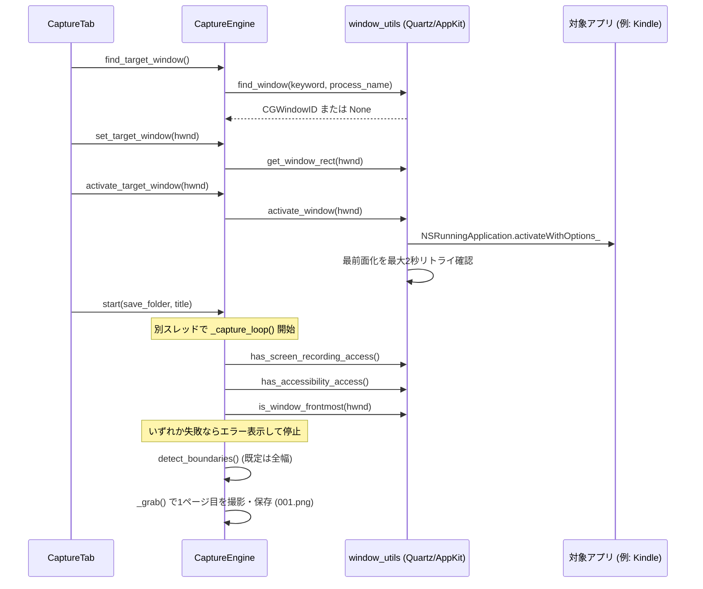
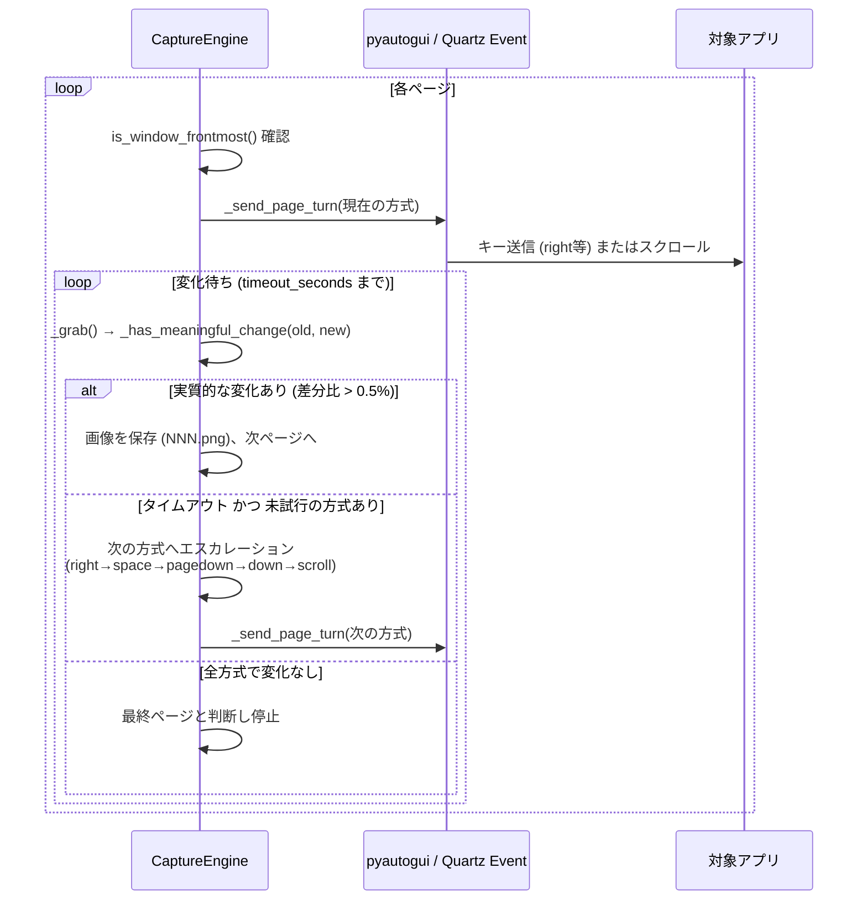

# キャプチャ処理のシーケンス図

`ui/capture_tab.py` の「キャプチャ開始」ボタンから、`CaptureEngine`
（`core/capture_engine.py`）が1ページを撮影し終えるまでの流れです。

## 起動〜1ページ目撮影まで

## 2ページ目以降: ページめくり + エスカレーション

## 補足

- 一度エスカレーションで有効な方式が見つかると、`active_turn_idx` が
  更新され、以降のページも同じ方式が使われ続けます（毎回最初からやり直さない）
- `is_window_frontmost()` のチェックはループの先頭で毎回行われ、対象アプリが
  最前面でなくなった場合は即座に安全停止します（詳細は
  [../developer/architecture.md](../developer/architecture.md)）
