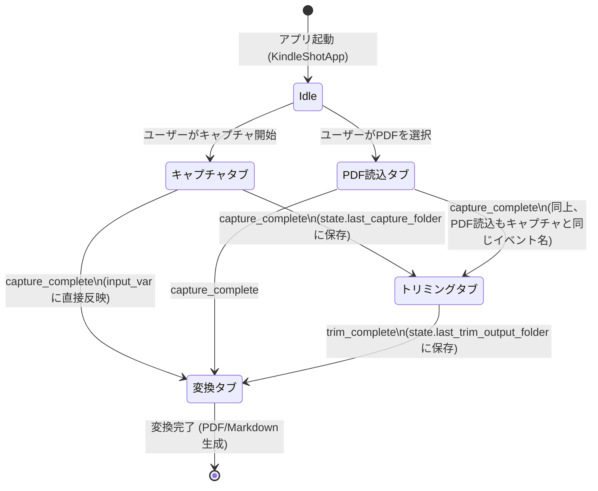

# タブ間状態遷移図

`ui/state.py` の `AppState` が発行するイベントと、それを購読する各タブの関係です。

## 実装メモ

- `AppState.notify(event, data)` は登録済みリスナー全員に同期的に通知します。
  リスナーは `add_listener()` で登録した `_on_state_change(event, data)` メソッドです
- `capture_complete` は「キャプチャタブ」「PDF読込タブ」の両方から発行される
  共通イベント名です。両者は「画像フォルダを用意する」という同じ役割を
  果たすため、下流（トリミング・変換タブ）は発行元を区別する必要がありません
- `trim_complete` は「トリミングタブ」のみが発行します
- 変換タブはこの2つのイベントの両方を購読しており、`capture_complete` でも
  `trim_complete` でも自分の入力フォルダ欄を更新します（`ui/convert_tab.py`
  の `_on_state_change()`）
- 状態は `AppState` インスタンス1つがアプリ全体で共有されます
  （`ui/main_window.py` の `KindleShotApp.__init__` で生成し、各タブの
  コンストラクタに渡すだけ）。永続化はされず、アプリ終了で失われます
  （永続化されるのは `config.json` に保存される設定値のみ）
