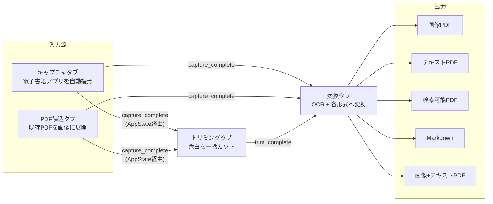

# 全体ワークフロー図

## タブ間の入出力関係



## ポイント

- 「キャプチャ」と「PDF読込」はどちらも同じ役割（画像フォルダの入力源）を果たす、
  互換の入り口です
- 各タブは独立して単体でも動作します（例: 既にトリミング済みの画像フォルダを
  直接「変換」タブに指定してもよい）
- タブ間の連携は `ui/state.py` の `AppState` によるイベント通知
  （`capture_complete`, `trim_complete`）で行われ、直接の関数呼び出しはありません
  （詳細は [../developer/architecture.md](../developer/architecture.md)）

## 出力形式ごとのOCR要否

```mermaid
flowchart TD
    Start[画像フォルダ] --> Q{OCRが必要な形式?}
    Q -- "画像PDF" --> NoOCR[OCRなしで即PDF化]
    Q -- "テキストPDF /<br/>検索可能PDF /<br/>Markdown /<br/>画像+テキストPDF" --> OCR[NDLOCR-Liteで<br/>全ページOCR実行]
    OCR --> Rep[置換辞書適用<br/>(replacements.json)]
    Rep --> Chap[章自動検出<br/>(任意)]
    Chap --> Build[各形式のビルダーへ]
```
